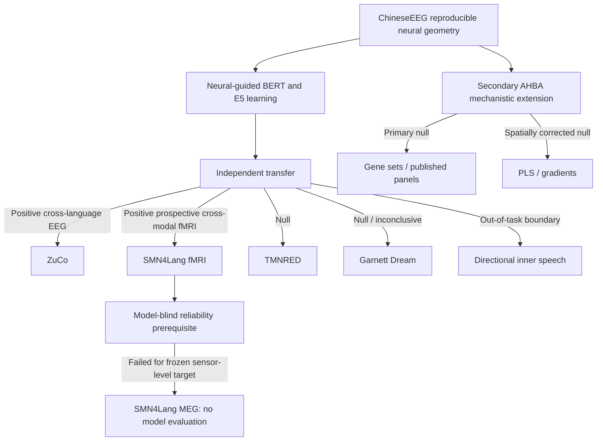

# 1. NeuroSem Project Overview

**Last updated:** 2026-08-28

NeuroSem asks whether reproducible human neural representational geometry can be used not only to evaluate language models, but to constrain their learning in a way that transfers to independent neural measurements.

## Current scientific conclusion

The strongest defensible conclusion is:

> Human language-related neural geometry can provide a transferable relational constraint on language representations. A constraint learned from Chinese natural-reading EEG improves alignment to independent English-reading EEG and prospectively to language-network fMRI in different participants during naturalistic auditory comprehension, but transfer is selective rather than universal and should only be tested when the target neural geometry is itself reproducible.

The project separates three empirical stages that must not be conflated:

1. **Target reliability:** does a reproducible neural geometry exist?
2. **Learnability:** can model training move representations toward that geometry?
3. **Transfer:** does the learned change remain detectable in independent neural contexts?

A secondary fourth question, whether a specific transcriptomic mechanism explains the geometry, remains unsupported.

## Evidence hierarchy

## Locked positive evidence

- **ChineseEEG Little Prince:** selected temporal-mean EEG geometry is reproducible after nuisance control, residual LOO approximately **0.121**.
- **Development neural-model correspondence:** six of six held-out Little Prince runs are positive, mean residual correspondence **0.0085**, exact one-sided run-level sign-flip **p = 0.015625**.
- **Sealed BERT learning:** neural-guided training exceeds matched text-only and shuffled-neural controls in both run-07 seeds.
- **ZuCo 2.0 normal reading:** residual EEG reliability **0.06742**, 95% CI **[0.05831, 0.07687]**, **17/17** participants positive. Frozen E5 lambda 0.10 minus lambda 0 transfer **+0.0016637**, 95% CI **[+0.0012294,+0.0021452]**, **17/17** positive, one-sided exact sign-flip **p = 7.63e-06**.
- **SMN4Lang fMRI:** model-blind language-network reliability **0.65327**, 95% CI **[0.63945,0.66843]**, **12/12** positive. Frozen E5 transfer **+0.00085250**, 95% CI **[+0.00078966,+0.00091398]**, **12/12** positive, exact one-sided sign-flip **p = 0.00024414**.

The fMRI effect is small in absolute RSA units. Its value is the prospective design, independence, absence of target-dataset model optimization, and participant-level directional consistency.

## Locked boundary conditions

- **TMNRED:** neural geometry is weakly reproducible, but frozen E5 transfer is null, mean delta **+0.000020**, one-sided **p = 0.402**.
- **Garnett Dream:** same-participant/new-text EEG geometry is reproducible, but frozen E5 transfer is null/inconclusive, mean delta **+0.0003266**, 95% CI crossing zero, **6/10** positive, one-sided **p = 0.1016**.
- **Directional inner speech:** out-of-task lambda 0.10 minus lambda 0 contrast is approximately **-0.001786** with no positive transfer evidence.
- **Generic semantic benchmarks:** no stable neural-specific improvement.

## SMN4Lang MEG reliability boundary

The MEG branch is complete and closed.

The prospectively frozen sensor-level representation used released 1-40 Hz data, bad-sample exclusion, all retained magnetometers and planar gradiometers, and 32 normalized-time RMS bins per sensor type. Cross-participant story-geometry reliability was:

- mean LOO **0.007713**;
- median **0.011320**;
- **7/12** positive;
- 95% participant-bootstrap CI **[-0.007627, +0.021655]**;
- exact one-sided sign-flip **p = 0.16870**.

The prespecified model-blind gate failed, so **no E5 model evaluation was performed**.

A separately frozen post-confirmatory 4/8/16-bin temporal-granularity family also produced no familywise-reliable target. No candidate passed and no model evaluation was opened. This is a **reliability boundary**, not a negative MEG transfer result, and does not imply that MEG generally lacks language-related geometry.

## AHBA mechanistic extension

AHBA remains secondary to the transfer claim. Prespecified GABAergic, serotonergic and pathway tests are null. Exploratory whole-transcriptome PLS and transcriptomic gradients do not survive spatial inference. Independently frozen published language-gene panels are primary-null. A stronger no-mirror dyslexia-panel sensitivity is exploratory and driven mainly by a right-hemisphere expression-map shift under sparse AHBA right-hemisphere sampling; it does not revise the primary null.

## Publication state

The project is in **evidence-locked manuscript consolidation**. New outcome-bearing searches are not justified for the present paper.

The main Nature architecture is:

1. ChineseEEG reproducible geometry and learnability.
2. ZuCo cross-language EEG transfer.
3. SMN4Lang prospective cross-modal fMRI transfer as the capstone.
4. TMNRED, Garnett and directional inner-speech transfer boundaries.
5. SMN4Lang MEG reliability boundary.
6. Generic semantic dissociation; AHBA moved to Extended Data / Supplementary material unless editorially required.

Current manuscript-facing sources are under `paper/`, especially `NATURE_MANUSCRIPT_DRAFT_V2.md`, `NATURE_SUBMISSION_PACKAGE.md`, and `REFERENCE_SOURCE_AUDIT.md`.

## Stopping rules

- Do not reopen model, layer, lambda, checkpoint, ROI, lag, HRF, semantic-unit or participant searches for ZuCo or SMN4Lang fMRI.
- Do not rescue TMNRED or Garnett through post-hoc target search.
- Do not run E5 on any SMN4Lang MEG representation after the failed reliability gates.
- Do not add further MEG frequency, sensor, source, latency or temporal alternatives for the present paper.
- Do not screen additional molecular panels for significance.
- Preserve nulls and failed reliability gates in the manuscript record.

## Read next

2. [`2_DATASETS_AND_TASKS.md`](2_DATASETS_AND_TASKS.md)
3. [`3_RESULTS_AND_COMPARISONS.md`](3_RESULTS_AND_COMPARISONS.md)
4. [`4_EXPERIMENT_LEDGER.md`](4_EXPERIMENT_LEDGER.md)
5. [`5_CURRENT_ROADMAP.md`](5_CURRENT_ROADMAP.md)
6. [`6_AHBA_CURRENT_STATUS_AND_NEXT_STEPS.md`](6_AHBA_CURRENT_STATUS_AND_NEXT_STEPS.md)
