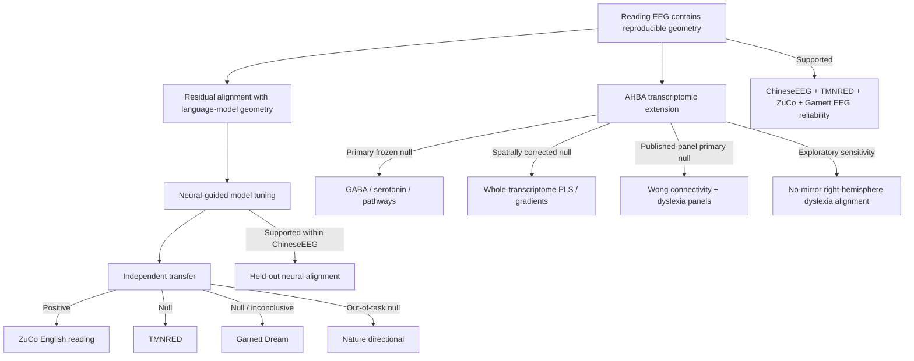

# 1. NeuroSem Project Overview

**Last updated:** 2026-08-27

This is the first document to read after `README.md`. It summarizes the scientific question, what is supported, what is not supported, the completed AHBA mechanistic extension, and the current consolidation plan.

## Core question

NeuroSem asks whether human EEG contains reproducible relational structure associated with language meaning, whether that structure generalizes across people, texts, datasets, tasks, and languages, whether residual neural geometry can provide useful auxiliary supervision for language models, and whether the spatial pattern of that geometry can be linked to specific cortical molecular systems.

The project separates four claims that must not be conflated:

1. **Neural geometry exists and is reproducible.**
2. **Neural-guided training changes a model toward the development EEG geometry.**
3. **The neural-guided advantage transfers beyond the development setting.**
4. **The established semantic neural geometry has a specific transcriptomic mechanism.**

Current evidence supports claim 1 across multiple reading datasets, supports claim 2 within ChineseEEG, supports claim 3 in one independent English reading dataset (ZuCo) but not universally, and does not establish claim 4.

## Scientific logic at a glance

Numerical evidence is summarized in `3_RESULTS_AND_COMPARISONS.md`. The complete AHBA record is in `6_AHBA_CURRENT_STATUS_AND_NEXT_STEPS.md`.

## Current scientific status

### Supported

- ChineseEEG Little Prince silent reading contains reproducible cross-subject neural geometry after nuisance control.
- Residual correspondence between this EEG geometry and Chinese BERT representations is small but consistently positive across six narrative runs.
- BERT neural-guided tuning improves sealed ChineseEEG run-07 neural alignment relative to matched text-only and shuffled-neural controls in two seeds.
- Multilingual E5 reproduces the qualitative within-ChineseEEG neural-guided alignment phenomenon.
- TMNRED independently supports weak positive reliability of the prospectively frozen temporal-mean EEG geometry.
- ZuCo 2.0 Task 1 Normal Reading provides a strong independent English-reading replication of the same frozen representation: residual LOO reliability about **0.06742**, 95% CI **[0.05831, 0.07687]**, **17/17** participants positive.
- The frozen ChineseEEG-to-ZuCo E5 neural-guided lambda 0.10 versus text-only lambda 0 contrast is positive: mean participant delta **+0.001664**, 95% CI **[+0.001229, +0.002145]**, **17/17** positive, one-sided exact sign-flip **p = 7.63e-06**.
- Garnett Dream provides positive same-participant/new-text EEG reliability with frozen `row_mean_all`: mean residual LOO **0.01863**, 95% CI **[0.01636, 0.02085]**, **10/10** positive.

### Not supported / boundary conditions

- Generic external semantic benchmarks do not show a stable neural-specific benefit.
- TMNRED frozen E5 transfer is null.
- Alternative TMNRED EEG summaries do not rescue that transfer result.
- Nature directional inner speech is an out-of-task boundary condition and shows null transfer.
- Garnett Dream frozen E5 transfer is null/inconclusive: mean delta **+0.0003266**, 95% CI **[-0.0001218, +0.0007560]**, **6/10** positive, one-sided exact sign-flip **p = 0.1016**.
- Prespecified AHBA GABAergic, serotonergic, and pathway associations are null.
- Exploratory whole-transcriptome PLS and transcriptomic gradients do not survive spatial correction.
- Independent published language-related gene panels do not satisfy the frozen primary validation rule.

## Garnett Dream final interpretation

Garnett Dream tests same-participant/new-text generalization within the original ChineseEEG acquisition family.

The EEG geometry itself generalizes reliably to the new narrative, but the ChineseEEG-trained neural-guided E5 advantage does not transfer convincingly over the matched text-only model. The frozen comparison was lambda .10 neural-guided minus lambda 0 text-only, with the exact segmented-XLSX row-text map and full nuisance family restored.

This distinction matters: **neural geometry generalization is positive, model-transfer generalization is not universal.**

## AHBA mechanistic extension: current status

The AHBA extension has progressed from plan to completed analysis family.

The spatial pipeline uses:

`AHBA cortical transcriptomics -> cortical spatial map -> EEG forward/source-sensitivity projection -> 128-channel molecular weighting / DK68 cortical comparison -> frozen NeuroSem analysis`

The project froze the dataset-provided 128-channel CapTrak geometry, fsaverage ico-5 source space, three-layer BEM, explicit registration, average reference, fixed surface-normal orientation, absolute lead-field sensitivity, DK cortical mapping, and donor/bilateral conventions before biological outcome testing.

### Frozen mechanistic result

The seven prespecified GABAergic/serotonergic/pathway sets were all null under participant-level inference and multiplicity correction. This result is locked.

### Exploratory transcriptomic result

Whole-transcriptome PLS1 showed moderate in-sample alignment (`r = 0.4574`, `R^2 = 0.2092`) but failed the 5,000-spin spatial null (`p = 0.2745`). No intrinsic transcriptomic gradient survived FDR.

### Independent published language panels

Two exact Wong et al. language-related panels were frozen independently of NeuroSem outcomes:

- six structural-connectivity genes;
- fourteen dyslexia-associated genes.

The six-gene panel was clearly null. The fourteen-gene dyslexia panel was suggestive in the primary mirrored analysis (`rho = -0.2733`, spatial `p = 0.0516`) but failed the frozen spatial and co-expression-aware multiple-testing criteria.

### Mirroring sensitivity

The no-mirror dyslexia-panel sensitivity was much stronger (`rho = -0.4776`, spatial `p = 0.0032`, co-expression-profile `p = 0.0010`). A dedicated post-hoc diagnostic showed that the difference is driven mainly by the right hemisphere rather than parcel loss:

- left hemisphere: mirrored `rho = -0.5670`, no-mirror `rho = -0.5804`;
- right hemisphere: mirrored `rho = +0.0038`, no-mirror `rho = -0.4310`.

This remains exploratory because native AHBA right-hemisphere sampling is sparse and the frozen primary mirrored test was null. It is a methodological/hemispheric sensitivity finding, not a rescued confirmatory molecular mechanism.

See `6_AHBA_CURRENT_STATUS_AND_NEXT_STEPS.md` for the complete record.

## Current interpretation

The strongest defensible conclusion is:

> Reading-related EEG contains a small but reproducible relational geometry across independent datasets and languages. Neural-guided model training improves alignment to the ChineseEEG development target and transfers that advantage to independent English natural-reading EEG in ZuCo, but not detectably to TMNRED or Garnett Dream. Transcriptomic analyses do not establish a specific molecular mechanism. A post-hoc AHBA mirroring diagnostic identifies a reproducible hemispheric preprocessing sensitivity that warrants independent future validation rather than additional within-AHBA significance search.

The project should not be summarized as showing universal improvement of language-model semantics, universal neural-guided transfer, or causal involvement of GABAergic/serotonergic systems.

## Publication strategy

The project is now mature enough to shift from analysis generation to manuscript consolidation.

The final paper should preserve the full evidence architecture:

1. ChineseEEG discovery and within-dataset neural-guided learning.
2. TMNRED independent geometry replication with null transfer.
3. ZuCo independent cross-language geometry replication with positive frozen transfer.
4. Garnett same-participant/new-text geometry replication with null/inconclusive transfer.
5. Nature out-of-task null boundary condition.
6. AHBA frozen molecular nulls plus the exploratory hemispheric mirroring sensitivity.

Aspirational journal order remains evidence-dependent rather than target-driven.

## Immediate next steps

1. Treat the AHBA analysis family as complete for the current paper; do not search additional subsets for significance.
2. Selectively reconcile final analysis code from narrow execution branches into canonical `main` without wholesale merges of reduced manifests or temporary wrappers.
3. Update the experiment ledger and manuscript-facing tables with final Garnett and AHBA results.
4. Build figures for the cross-dataset validation chain and AHBA mechanistic extension.
5. Draft Results and Methods from frozen protocols and exact job provenance.
6. If the AHBA hemispheric signal is pursued further, use an independent bilateral molecular resource or a prospectively frozen lateralization study rather than additional post-hoc AHBA searches.

## Read next

2. [`2_DATASETS_AND_TASKS.md`](2_DATASETS_AND_TASKS.md)
3. [`3_RESULTS_AND_COMPARISONS.md`](3_RESULTS_AND_COMPARISONS.md)
4. [`4_EXPERIMENT_LEDGER.md`](4_EXPERIMENT_LEDGER.md)
5. [`5_CURRENT_ROADMAP.md`](5_CURRENT_ROADMAP.md)
6. [`6_AHBA_CURRENT_STATUS_AND_NEXT_STEPS.md`](6_AHBA_CURRENT_STATUS_AND_NEXT_STEPS.md)
