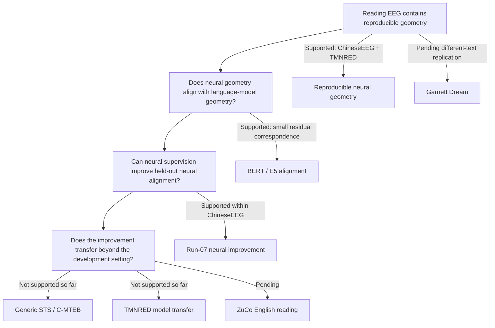

# 1. NeuroSem Project Overview

**Last updated:** 2026-08-25

This is the first document to read after `README.md`. It summarizes the scientific question, how the project evolved, what is supported so far, what is not supported, and what remains in progress.

## Core question

NeuroSem asks whether human EEG contains reproducible relational structure associated with language meaning, whether that structure generalizes across people, texts, datasets, tasks, and languages, and whether the residual neural geometry can provide useful auxiliary supervision for language models.

The project now separates three claims that must not be conflated:

1. **Neural geometry exists and is reproducible.** Do linguistic items evoke EEG patterns whose pairwise relationships are reproducible across participants after nuisance control?
2. **Neural-guided training changes a model toward the training EEG geometry.** Does adding a neural relational loss improve held-out alignment to the EEG geometry used for development?
3. **The improvement transfers.** Does the neural-guided model outperform matched text-only tuning on independent semantic benchmarks or independent EEG datasets?

Current evidence supports claims 1 and 2 more strongly than claim 3.

## Scientific logic at a glance

The diagram is a conceptual summary. Numerical evidence and uncertainty are documented in `3_RESULTS_AND_COMPARISONS.md`.

## Current scientific status

### Supported so far

- In ChineseEEG Little Prince silent reading, the selected whole-row temporal-mean EEG representation has reproducible cross-subject geometry after nuisance control.
- Residual correspondence between this EEG geometry and Chinese BERT representations is small but consistent across six narrative runs.
- BERT neural-guided tuning improves held-out ChineseEEG run-07 neural alignment relative to matched text-only tuning in two seeds.
- An independent multilingual-E5 architecture reproduces the central within-ChineseEEG neural-guided alignment phenomenon, so the effect is not only a BERT-specific implementation artifact.
- TMNRED provides independent Chinese-reading evidence that the EEG geometry itself is reproducible, although the effect is modest.

### Not supported so far

- Brain-guided tuning has not shown a stable advantage on generic external semantic similarity benchmarks.
- The frozen ChineseEEG-trained E5 neural-guided model did not significantly outperform matched text-only tuning on independent TMNRED EEG geometry.
- Alternative TMNRED EEG summaries, including amplitude SD and an 8-bin temporal representation, did not rescue the prespecified E5 transfer contrast.
- The directional-word inner-speech dataset did not provide convincing transfer evidence and is not task-equivalent to the reading datasets.

### In progress / next decisive tests

- **ZuCo 2.0 Task 1 Normal Reading:** independent English reading and cross-language EEG-geometry replication. Public-file inventory and event-format mapping are complete; full-cohort materialization/QC is the current next stage.
- **ChineseEEG Garnett Dream:** same participants/acquisition family as Little Prince, but a different and substantially larger novel. This should be used as a strong different-text replication before making broad cross-dataset claims.

## Why task comparability matters

The main discovery and replication datasets are reading paradigms:

- ChineseEEG Little Prince: silent Chinese natural reading.
- ChineseEEG Garnett Dream: silent Chinese natural reading.
- TMNRED: Chinese sentence reading.
- ZuCo 2.0 Task 1 NR: English normal reading.

The Nature directional dataset is different. Participants perform overt or covert articulation of six directional concepts. The primary NeuroSem analysis uses covert/inner speech. That is useful as an out-of-task mechanistic generalization test, but it is not an equivalent reading replication. Failure there should not be interpreted as direct falsification of reading-related neural geometry.

## What "mean EEG geometry" means

For one linguistic item, let the EEG epoch be a matrix with `C` channels and `T` time samples. The primary simple representation averages across time **within each channel**, not across channels:

`x_c = mean_t EEG[c, t]`

The item becomes a `C`-dimensional vector. Pairwise distances between item vectors form the neural representational dissimilarity matrix (RDM). RSA then compares that neural RDM with a model RDM while controlling nuisance RDMs.

This temporal mean is deliberately simple and reproducible, but it discards temporal dynamics. The project has therefore also examined amplitude variability, temporal bins, spectral power, and phase-oriented candidates. These alternatives are secondary unless prospectively frozen before an independent test.

## Current interpretation

The most defensible conclusion is not "brain supervision improves language models." That claim is too broad for the evidence.

The current conclusion is:

> Reading-related EEG contains a small but reproducible relational geometry. Neural-guided training can move model geometry toward the development EEG target, but evidence that this change transfers to generic semantic tasks or independent EEG datasets is currently weak or null.

This distinction is central to the project.

## Publication strategy

Current aspirational targets are:

1. **Nature Machine Intelligence**, if the final study supports a strong, general, machine-learning-relevant claim with multiple independent neural validations and a convincing model-learning result.
2. **Nature Neuroscience**, if the strongest final contribution is the reproducibility and structure of neural language geometry rather than transferable model improvement.

The target journal must follow the evidence. We should narrow the claim rather than add post-hoc analyses to force the original machine-learning story.

## Read next

2. [`2_DATASETS_AND_TASKS.md`](2_DATASETS_AND_TASKS.md): what each dataset contains, what the participant was doing, and why each dataset is used.
3. [`3_RESULTS_AND_COMPARISONS.md`](3_RESULTS_AND_COMPARISONS.md): numerical results and comparisons completed so far.
4. [`4_EXPERIMENT_LEDGER.md`](4_EXPERIMENT_LEDGER.md): chronological analysis/job ledger, including failures, protocol changes, and current work.

For detailed frozen methods, see the protocol files already present under `docs/` and `ANALYSIS_PLAN.md`.
