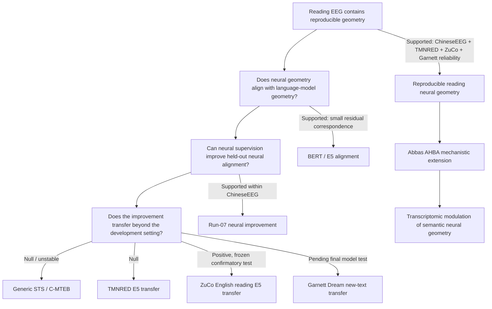

# 1. NeuroSem Project Overview

**Last updated:** 2026-08-26

This is the first document to read after `README.md`. It summarizes the scientific question, how the project evolved, what is supported so far, what is not supported, and what remains in progress.

## Core question

NeuroSem asks whether human EEG contains reproducible relational structure associated with language meaning, whether that structure generalizes across people, texts, datasets, tasks, and languages, and whether the residual neural geometry can provide useful auxiliary supervision for language models.

The project separates three claims that must not be conflated:

1. **Neural geometry exists and is reproducible.** Do linguistic items evoke EEG patterns whose pairwise relationships are reproducible across participants after nuisance control?
2. **Neural-guided training changes a model toward the training EEG geometry.** Does adding a neural relational loss improve held-out alignment to the EEG geometry used for development?
3. **The improvement transfers.** Does the neural-guided model outperform matched text-only tuning on independent semantic benchmarks or independent EEG datasets?

The current evidence supports claim 1 strongly across multiple reading datasets, supports claim 2 within ChineseEEG, and gives one positive independent reading-EEG transfer result in ZuCo while generic semantic transfer and TMNRED transfer remain null.

## Scientific logic at a glance

Numerical evidence and uncertainty are documented in `3_RESULTS_AND_COMPARISONS.md`. Current operational sequencing is documented in `5_CURRENT_ROADMAP.md`.

## Current scientific status

### Supported

- In ChineseEEG Little Prince silent reading, the selected whole-row temporal-mean EEG representation has reproducible cross-subject geometry after nuisance control.
- Residual correspondence between this EEG geometry and Chinese BERT representations is small but consistent across six narrative runs.
- BERT neural-guided tuning improves held-out ChineseEEG run-07 neural alignment relative to matched text-only tuning in two seeds.
- An independent multilingual-E5 architecture reproduces the within-ChineseEEG neural-guided alignment phenomenon.
- TMNRED provides independent Chinese-reading evidence that the primary temporal-mean EEG geometry itself is reproducible, although weakly.
- ZuCo 2.0 Task 1 Normal Reading provides a much stronger independent English-reading replication of the same prospectively frozen temporal-mean representation: nuisance-residualized leave-one-subject-out reliability was about **0.0674**, 95% CI **[0.0583, 0.0769]**, with **17/17** participants positive.
- In the single frozen ChineseEEG-to-ZuCo model-transfer test, multilingual-E5 neural-guided lambda 0.10 outperformed matched text-only lambda 0 on the frozen ZuCo temporal-mean EEG target: mean participant delta **+0.001664**, 95% CI **[+0.001229, +0.002145]**, **17/17** participants positive, exact one-sided sign-flip **p = 7.63e-06**.
- ChineseEEG Garnett Dream now provides positive same-participant/new-text EEG-only reliability with the frozen `row_mean_all` representation: mean nuisance-residualized participant LOO reliability **0.01863**, 95% CI **[0.01636, 0.02085]**, **10/10** participants positive, exact one-sided sign-flip **p = 0.0009766**.
- The exact Garnett presentation-row to segmented-text mapping is now structurally frozen for all 18 chapters/runs using the authors' non-display XLSX files and the validated one-row schema-header offset.

### Not supported / important boundary conditions

- Brain-guided tuning has not shown a stable advantage on generic external semantic similarity benchmarks.
- The frozen ChineseEEG-trained E5 neural-guided model did not significantly outperform matched text-only tuning on independent TMNRED EEG geometry.
- Alternative TMNRED EEG summaries, including amplitude SD and an 8-bin temporal representation, did not rescue the prespecified E5 transfer contrast.
- The Nature directional-word inner-speech dataset did not provide convincing transfer evidence and is not task-equivalent to the reading datasets.

### Remaining core validation

- **ChineseEEG Garnett Dream model transfer:** EEG reliability and exact text mapping are complete. The next outcome-bearing analysis is the single frozen multilingual-E5 lambda 0.10 versus lambda 0 transfer test on `row_mean_all`, with the full text-derived nuisance family restored.
- **AHBA transcriptomic extension:** Abbas's mechanistic proposal is now part of the main project roadmap. Model-blind transcriptomic preprocessing, 128-channel forward/source-sensitivity projection, molecular-family freezing, donor robustness, and spatial-null design must be completed before any AHBA-weighted NeuroSem outcome is inspected.

## Why task comparability matters

The main discovery and replication datasets are reading paradigms:

- ChineseEEG Little Prince: silent Chinese natural reading.
- ChineseEEG Garnett Dream: silent Chinese natural reading.
- TMNRED: Chinese sentence reading.
- ZuCo 2.0 Task 1 NR: English normal reading.

The Nature directional dataset is different. Participants perform overt or covert articulation of six directional concepts. The primary NeuroSem analysis uses covert/inner speech. That is useful as an out-of-task mechanistic generalization test, but it is not an equivalent reading replication. Failure there should not be interpreted as direct falsification of reading-related neural geometry.

## What "mean EEG geometry" means

For one linguistic item, let the EEG epoch be a matrix with `C` channels and `T` time samples. The primary simple representation averages across time **within each channel**, not across channels:

`x_c = mean_t EEG[c, t]`

The item becomes a `C`-dimensional vector. Pairwise distances between item vectors form the neural representational dissimilarity matrix (RDM). RSA then compares that neural RDM with a model RDM while controlling nuisance RDMs.

This temporal mean is deliberately simple and reproducible. Richer alternatives such as amplitude SD, temporal bins, spectral power, and phase-oriented summaries remain secondary unless prospectively frozen before an independent test.

## Abbas AHBA mechanistic extension

Abbas proposed adding Allen Human Brain Atlas transcriptomics as a molecular weighting of the 128-channel ChineseEEG spatial geometry. The scientifically preferred implementation is not a literal nearest-cortex-under-electrode assignment. The planned chain is:

`AHBA cortical transcriptomics -> cortical spatial map -> EEG forward/source-sensitivity projection -> 128-channel molecular weighting -> frozen NeuroSem test`

The first biological families to freeze are GABA receptor subunits and broader GABAergic machinery, serotonin receptor and broader serotonergic groups, human cell-type marker sets, and a small curated pathway panel. The analysis must use donor robustness, spatial-autocorrelation-preserving nulls, size-matched random gene-set controls, multiplicity correction, and explicit bilateral handling. See `abbas_ahba_transcriptomic_extension.md` and `5_CURRENT_ROADMAP.md`.

## Current interpretation

The strongest defensible conclusion is now:

> Reading-related EEG contains a small but reproducible relational geometry across independent datasets and languages. Neural-guided model training improves alignment to the ChineseEEG development target and, in a frozen confirmatory test, produces a small but highly consistent improvement in alignment to independent English natural-reading EEG in ZuCo. Garnett Dream further shows that the frozen neural geometry itself generalizes to a different narrative in the same participant/acquisition family. This benefit does not generalize uniformly: generic semantic benchmarks, TMNRED transfer, and the out-of-task Nature directional test remain null or weak.

The positive ZuCo result should not be generalized into a claim that brain supervision broadly improves language-model semantics. The pending Garnett model-transfer test will determine whether the neural-guided advantage generalizes across narratives within ChineseEEG. The AHBA extension is mechanistic and cannot rescue or redefine the primary validation chain.

## Publication strategy

Current aspirational targets are:

1. **Nature Machine Intelligence**, if the final manuscript can make a strong machine-learning-relevant case around transferable neural alignment while clearly respecting the null generic-semantic results.
2. **Nature Neuroscience**, if the strongest contribution is the reproducibility and cross-language structure of reading-related neural geometry, with neural-guided modeling and transcriptomic mechanism as secondary contributions.

The final target should follow the evidence rather than post-hoc optimization.

## Immediate next steps

1. Implement and run the single frozen Garnett Dream E5 lambda .10 vs 0 model-transfer analysis.
2. In parallel, begin Abbas's AHBA model-blind preprocessing and 128-channel source-sensitivity preparation.
3. Freeze AHBA GABAergic, serotonergic, cell-type, pathway, donor/bilateral, and spatial-null choices before molecular outcome analysis.
4. Run the frozen AHBA mechanistic analysis only after that preparation is locked.
5. Build manuscript figures and Results/Methods in parallel.

## Read next

2. [`2_DATASETS_AND_TASKS.md`](2_DATASETS_AND_TASKS.md): what each dataset contains, what the participant was doing, and why each dataset is used.
3. [`3_RESULTS_AND_COMPARISONS.md`](3_RESULTS_AND_COMPARISONS.md): numerical results and the cross-dataset evidence table.
4. [`4_EXPERIMENT_LEDGER.md`](4_EXPERIMENT_LEDGER.md): chronological analysis/job ledger, including failures, protocol changes, and current work.
5. [`5_CURRENT_ROADMAP.md`](5_CURRENT_ROADMAP.md): operational sequence, Abbas AHBA track, and stopping rules.

For detailed frozen methods, see the protocol files under `docs/` and `ANALYSIS_PLAN.md`.
