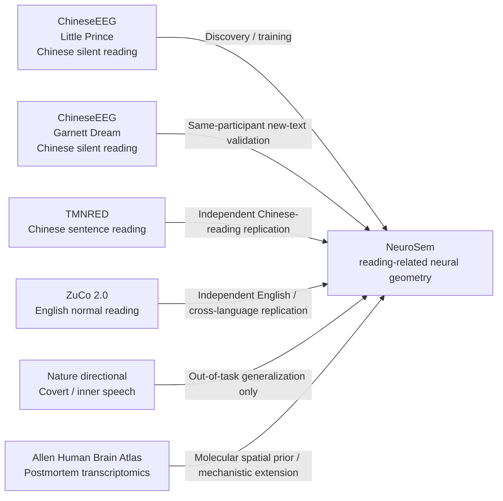

# 2. Datasets and Tasks

**Last updated:** 2026-08-26

This document explains what each dataset contributes to NeuroSem, what participants were actually doing, and which scientific claim each dataset can test. This distinction matters because a null result from a different behavioral task is not equivalent to a null result from an independent replication of the same task.

## Dataset map

| Dataset | Participant task | Language | Recording | Current NeuroSem role | Status |
|---|---|---|---|---|---|
| ChineseEEG: Little Prince | Silent natural reading | Chinese | 128-channel EEG + eye tracking | Primary discovery and model-development dataset | Core analyses complete |
| ChineseEEG: Garnett Dream | Silent natural reading | Chinese | 128-channel EEG + eye tracking | Same-participant, different-text validation | EEG reliability + exact row-text mapping complete; frozen E5 transfer pending |
| TMNRED | Reading Chinese sentences | Chinese | EEG | Independent Chinese-reading replication | EEG reliability and E5 transfer complete |
| ZuCo 2.0 Task 1 NR | Normal reading of English sentences | English | EEG + eye tracking | Independent English-reading and cross-language replication | Reliability and frozen positive E5 transfer complete |
| Nature directional-word dataset | Overt/covert articulation of six directional concepts | Russian + Spanish | EEG; EMG subset | Out-of-task mechanistic/generalization test | Analyzed; not task-equivalent to reading |
| Allen Human Brain Atlas | No participant task; postmortem cortical tissue | N/A | Gene-expression microarray/transcriptomic atlas from six adult donors | Abbas-proposed molecular-mechanistic extension | Model-blind preparation pending |
| ChineseEEG-2 | Reading aloud / passive listening | Chinese | EEG + audio | Future cross-modal extension | Not part of the primary evidence chain |
| SIGNAL | Controlled sentence congruency/anomaly paradigm | Russian | EEG | Future semantic-specificity falsification dataset | Not analyzed |

## 2.1 ChineseEEG: Little Prince

Participants silently read Chinese text from *The Little Prince* while EEG and eye tracking were recorded.

Little Prince is the development/discovery dataset. It has been used for EEG representation selection, neural reliability analysis, BERT residual neural-semantic RSA, BERT neural-guided LoRA tuning, sealed run-07 evaluation, multilingual-E5 architecture replication, and neural-loss dose-response/Pareto exploration.

It should not be described as external validation.

## 2.2 ChineseEEG: Garnett Dream

The same ChineseEEG participants also read *Garnett Dream* under the same general acquisition family.

This is scientifically useful because the linguistic material changes while participant identity and many acquisition properties remain stable. It therefore tests whether the Little Prince result depends on one narrative.

Its correct role is **same-participant / new-text validation**, not independent-cohort replication.

### Current frozen state

Model-blind structural work established:

- the `ROWS -> ROWE` presentation unit within chapter/run;
- the filtered BrainVision source family;
- a structurally valid Garnett input set;
- chapter-wise item identities;
- an exact row-text mapping from the unique non-display segmented XLSX file for each of the 18 chapters/runs.

Frozen row-text rule:

`CHxx_ROWyyyy -> physical XLSX row yyyy + 1`

because physical row 1 is the validated `Chinese_text` schema header.

### EEG-only reliability

Primary `row_mean_all` result:

- mean nuisance-residualized participant LOO reliability: **0.01863**;
- median: **0.01895**;
- **10/10 participants positive**;
- participant-bootstrap 95% CI: **[0.01636, 0.02085]**;
- exact one-sided sign-flip p: **0.0009766**.

Thus the frozen temporal-mean geometry generalizes to a different narrative within the same participant/acquisition family.

### Remaining Garnett test

The next and only confirmatory model-transfer analysis should compare the already-trained ChineseEEG multilingual-E5 lambda 0.10 neural-guided adapter against matched lambda 0 text-only on the frozen Garnett `row_mean_all` target. No Garnett tuning is allowed.

## 2.3 TMNRED

Participants read Chinese sentences while EEG was recorded.

The model-blind materialization/QC process produced a frozen cohort of 29 participants across eight sessions. `sub-25` was excluded by the prospective data-quality rule; `sub-23` was retained with deterministic resampling where required. The final >=80% participant-coverage rule retained all 50 sentence items in every session.

Completed analyses include:

- EEG-only reliability for the frozen temporal-mean primary representation;
- sensitivity reliability for amplitude SD and an 8-bin temporal representation;
- frozen ChineseEEG-to-TMNRED multilingual-E5 transfer;
- explicitly exploratory transfer tests using the SD and 8-bin targets.

TMNRED establishes that reading-related EEG geometry generalizes weakly to an independent Chinese-reading cohort, but the neural-guided E5 advantage did not transfer detectably there.

## 2.4 ZuCo 2.0 Task 1 Normal Reading

Participants normally read English sentences while EEG and eye tracking were recorded.

ZuCo is important because it tests independent natural reading and cross-language generalization from Chinese to English at the same time.

### Frozen structural cohort

The public inventory contained 18 participants x 7 NR runs. Full model-blind QC froze 17 participants with all seven runs structurally ready; YTL was excluded before outcome analysis because three runs failed structural event checks.

Sentence identity was frozen as run + sentence order. Public task-material rows were aligned model-blind to EEG sentence units through a unique zero-cost word-count mapping; the first three material rows were skipped in every run. Sentence windows were delimited by ordered event pairs `10 -> 11` or `12 -> 13`.

### EEG-only reliability

- nuisance-residualized LOO reliability about **0.0674**;
- bootstrap 95% CI **[0.0583, 0.0769]**;
- **17/17 participants positive**;
- exact one-sided sign-flip **p = 7.63e-06**.

### Frozen E5 transfer

- mean participant delta **+0.001664**;
- median delta **+0.001487**;
- **17/17 participants positive**;
- bootstrap 95% CI **[+0.001229, +0.002145]**;
- exact one-sided sign-flip **p = 7.63e-06**.

This is the strongest evidence so far that neural-guided training can transfer its neural-alignment advantage across dataset, participants, and language in a task-matched reading setting.

## 2.5 Nature directional-word EEG dataset

Participants produced six directional concepts in overt and covert/inner-speech conditions. The NeuroSem primary analysis uses the covert/inner-speech condition.

This differs fundamentally from ChineseEEG, TMNRED, and ZuCo because it involves internally generating/articulating a small set of directional concepts rather than visually reading connected language.

Treat it as an out-of-task mechanistic/generalization test. Do not treat it as a task-matched external replication of reading-related EEG geometry.

## 2.6 Allen Human Brain Atlas

AHBA is not an EEG task dataset. It contains postmortem adult human brain gene-expression measurements and is being considered only as a **population-level molecular spatial prior**.

Abbas proposed using AHBA to test whether the spatial contribution of the established ChineseEEG semantic geometry preferentially aligns with specific molecular systems.

The preferred mapping is:

`AHBA cortical transcriptomics -> cortical spatial map -> EEG forward/source-sensitivity projection -> 128-channel molecular weighting`

not a literal gene-expression value beneath each scalp electrode.

Planned prespecified molecular groups include GABA receptor subunits and broader GABAergic machinery, serotonin receptor and broader serotonergic groups, human cell-type marker sets, and a small curated pathway panel. AHBA outcome analysis must use donor robustness, spatial-autocorrelation-preserving nulls, random gene-set controls, multiplicity correction, and frozen bilateral handling.

## 2.7 ChineseEEG-2

ChineseEEG-2 extends the corpus family into reading-aloud and passive-listening conditions. It may later help test whether a geometry learned during reading transfers across language modalities.

Important limitation: reading-aloud and listening participants are different groups, so this is not a within-person modality comparison.

## 2.8 SIGNAL

SIGNAL contains controlled Russian sentence conditions with semantic and grammatical manipulations. Its main potential role is a falsification/specificity test: does NeuroSem track semantic structure rather than generic anomaly, syntax, surprisal, or task difficulty?

## Validation hierarchy

For the current paper, the clean hierarchy is:

1. **ChineseEEG Little Prince**: discovery/development.
2. **TMNRED**: independent Chinese reading replication.
3. **ZuCo 2.0 Task 1 NR**: independent English reading, cross-language replication, and frozen positive model-transfer test.
4. **ChineseEEG Garnett Dream**: same-participant/new-text neural-geometry replication complete; final model-transfer test pending.
5. **Nature directional**: secondary out-of-task generalization/boundary condition.
6. **AHBA transcriptomics**: separately frozen mechanistic extension, not a replication dataset.

This ordering emphasizes independence first while preserving Garnett Dream's distinct role as a narrative-generalization test and AHBA's distinct role as a molecular mechanism analysis.

## Dataset provenance

Detailed dataset publications, candidate rankings, and historical selection notes remain in `DATASETS.md`. The operational plan is in `5_CURRENT_ROADMAP.md`.
