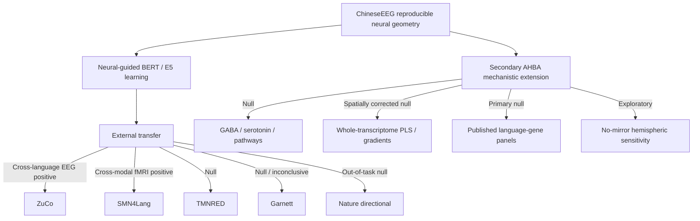

# 3. Results and Comparisons

**Last updated:** 2026-08-28

This file is the current numerical results summary for NeuroSem. The evidence hierarchy is scientific rather than chronological: development neural geometry, learnability by neural-guided training, independent neural transfer, cross-modal transfer, boundary conditions, and secondary mechanistic analyses.

## Cross-dataset evidence table

| Dataset / test | Role | Frozen neural reliability | Frozen model-transfer result | Interpretation |
|---|---|---|---|---|
| ChineseEEG Little Prince | Development EEG | temporal-mean residual LOO ~**0.121** | BERT run-07 neural-guided > text-only in two seeds | Establishes a reproducible neural target and learnability under held-out evaluation |
| ZuCo 2.0 Task 1 NR | Independent English reading EEG | `row_mean_all` **0.06742**, 95% CI **[0.05831, 0.07687]**, 17/17 positive | E5 lambda .10 - 0 = **+0.001664**, 17/17 positive, p=`7.63e-06` | Strong cross-dataset, cross-language EEG transfer |
| SMN4Lang fMRI | Independent Mandarin auditory narratives, different modality | LanA language-network residual LOO **0.65327**, 95% CI **[0.63945, 0.66843]**, 12/12 positive | E5 lambda .10 - 0 = **+0.0008525**, 12/12 positive, 95% CI **[+0.0007897,+0.0009140]**, p=`0.000244` | Strongest prospective external validation; cross-task and cross-modal transfer |
| TMNRED | Independent Chinese reading EEG | `row_mean_all` **0.00724**, 95% CI **[0.00356, 0.01079]** | E5 lambda .10 - 0 = **+0.000020**, p=.402 | Geometry replicates weakly; transfer null |
| ChineseEEG Garnett Dream | Same-participant/new-text EEG | `row_mean_all` **0.01863**, 95% CI **[0.01636, 0.02085]**, 10/10 positive | E5 lambda .10 - 0 = **+0.0003266**, p=.1016 | Neural geometry generalizes; model-transfer advantage null/inconclusive |
| Nature directional | Out-of-task inner speech EEG | not treated as task-matched reading reliability | lambda .10 - 0 ~**-0.001786** | Out-of-task null boundary condition |
| AHBA transcriptomics | Population postmortem mechanistic extension | N/A | primary molecular tests null | No specific molecular mechanism established |

## Evidence map

# 3.1 ChineseEEG neural geometry and BERT correspondence

The selected whole-row temporal-mean EEG representation was chosen on neural reliability before semantic testing.

Primary reliability:

- raw LOO approximately **0.220**;
- nuisance-residualized LOO approximately **0.121**.

Held-out Little Prince runs 01-06 showed small but consistently positive BERT final-layer residual neural-semantic correspondence:

| Run | Mean partial-Spearman |
|---|---:|
| 01 | 0.0057 |
| 02 | 0.0034 |
| 03 | 0.0145 |
| 04 | 0.0045 |
| 05 | 0.0174 |
| 06 | 0.0056 |

Cross-run summary:

- positive in **6/6** runs;
- mean run effect **0.0085**;
- exact one-sided run-level sign-flip **p = 0.015625**.

# 3.2 BERT neural-guided tuning: sealed run-07

| Arm | Seed 1 | Seed 2 |
|---|---:|---:|
| Base | 0.0319 | 0.0319 |
| Text-only | 0.0354 | 0.0341 |
| Neural-guided | **0.0371** | **0.0375** |
| Shuffled-neural | 0.0353 | 0.0338 |

Interpretation: neural-guided training can improve alignment to held-out ChineseEEG neural geometry relative to matched controls.

# 3.3 Generic semantic benchmark

Seed 1 eight-task mean Spearman:

- base 0.283464;
- text-only 0.308486;
- neural-guided 0.308575;
- shuffled-neural 0.307943.

Seed 2:

- base 0.283464;
- text-only 0.305020;
- neural-guided 0.301607;
- shuffled-neural 0.305266.

Interpretation: no stable neural-specific generic semantic advantage. Neural alignment and generic semantic benchmark quality are distinct objectives.

# 3.4 Multilingual-E5 replication

Multilingual E5 reproduced the qualitative within-ChineseEEG neural-target alignment phenomenon. Pareto work showed that neural alignment and generic semantic performance can trade off.

The primary external contrast carried forward without outcome-driven retuning was neural-guided lambda 0.10 versus matched text-only lambda 0.

# 3.5 ZuCo 2.0 English reading

## EEG-only reliability

Primary `row_mean_all`:

- mean raw LOO **0.06739**;
- mean residual LOO **0.06742**;
- median **0.06559**;
- 95% CI **[0.05831, 0.07687]**;
- **17/17** participants positive;
- one-sided exact sign-flip **p = 7.63e-06**.

## Frozen E5 transfer

- mean participant delta **+0.0016637**;
- median **+0.0014871**;
- **17/17** positive;
- 95% CI **[+0.0012294, +0.0021452]**;
- one-sided exact sign-flip **p = 7.63e-06**;
- two-sided **p = 1.53e-05**.

Interpretation: positive prospective transfer from ChineseEEG neural guidance to independent English natural-reading EEG.

# 3.6 SMN4Lang fMRI: prospective cross-modal validation

SMN4Lang / OpenNeuro `ds004078` was selected prospectively to test whether the established ChineseEEG neural-guided representation generalizes to independently measured cortical language geometry during naturalistic auditory comprehension.

The fMRI analysis was protected by a model-blind reliability gate before any E5 model was loaded.

## Frozen fMRI reliability

Primary representation:

- 12 participants;
- 60 stories;
- 720 participant-story runs;
- TR **0.710 s**;
- independently published LanA language-network mask, probability threshold **0.20**;
- **25,137** retained voxels;
- correlation-distance RDM across multivoxel patterns;
- nuisance control for temporal separation, HRF-convolved word-onset density, and HRF-convolved acoustic RMS envelope.

Reliability:

- mean participant residual LOO **0.65327**;
- median **0.64760**;
- **12/12** positive;
- 95% CI **[0.63945, 0.66843]**;
- exact one-sided sign-flip **p = 0.00024414**.

## Frozen E5 transfer

Semantic mapping used causal within-sentence prefix E5 states at released word onsets, the same fixed canonical HRF, and the same nuisance family. No SMN4Lang training, layer search, lambda search, checkpoint search, ROI search, lag/HRF search, or semantic-unit search occurred.

Mean participant residual RSA:

- lambda 0 text-only: **0.12092396**;
- lambda 0.10 neural-guided: **0.12177646**.

Primary contrast:

- mean delta **+0.00085250**;
- median delta **+0.00086365**;
- **12/12** participants positive;
- bootstrap 95% CI **[+0.00078966, +0.00091398]**;
- exact one-sided sign-flip **p = 0.00024414**.

Interpretation: a small but highly consistent cross-modal representational advantage. Neural guidance learned from Chinese reading EEG generalizes prospectively to independently measured language-network fMRI during auditory narratives in different participants.

# 3.7 TMNRED

Primary `row_mean_all` reliability:

- mean residual LOO **0.00724**;
- 95% CI **[0.00356, 0.01079]**.

Frozen E5 transfer:

- mean delta **+0.000020**;
- median **+0.000053**;
- 95% CI **[-0.000128, +0.000176]**;
- one-sided sign-flip **p = 0.402**.

Exploratory alternative targets did not rescue transfer.

Interpretation: geometry replicates weakly, but neural-guided transfer is null.

# 3.8 ChineseEEG Garnett Dream

## EEG-only reliability

Primary `row_mean_all`:

- raw mean LOO **0.03545**;
- nuisance-residualized mean LOO **0.01863**;
- median **0.01895**;
- **10/10** positive;
- 95% CI **[0.01636, 0.02085]**;
- one-sided exact sign-flip **p = 0.0009766**.

The exact presentation-row to segmented-text mapping was frozen across 18 chapters, totaling **9,047** linguistic items.

## Frozen E5 transfer

- mean participant delta **+0.0003266**;
- median **+0.0003319**;
- **6/10** positive;
- 95% CI **[-0.0001218, +0.0007560]**;
- one-sided exact sign-flip **p = 0.1015625**;
- two-sided **p = 0.203125**.

Interpretation: confirmatory null/inconclusive. Neural geometry generalizes to the new narrative, but the neural-guided model advantage does not generalize convincingly.

# 3.9 Nature directional-word dataset

Frozen covert/inner-speech lambda .10 - 0 mean difference approximately **-0.001786** with no positive transfer evidence.

Interpretation: out-of-task boundary condition, not a task-matched reading refutation.

# 3.10 AHBA mechanistic extension

The final model-blind AHBA pipeline froze standardized sensor geometry, fsaverage ico-5 source sensitivity, DK68 mapping, `abagen 0.1.3` expression preprocessing, primary left-to-right mirroring, and a no-mirror sensitivity.

Primary AHBA expression retained **15,677 genes**; no-mirror retained **15,633**.

Seven prespecified GABAergic/serotonergic/pathway gene sets were null after the frozen inferential framework. Mean rho values ranged from approximately **-0.050 to +0.056** and all primary BH q values were approximately **0.695**.

Exploratory whole-transcriptome PLS1 showed in-sample `r = 0.4574`, `R^2 = 0.2092`, but failed hemisphere-constrained spatial inference (`p = 0.2745`). No transcriptomic gradient survived FDR.

Two independently frozen published language-gene panels were also primary-null. The no-mirror dyslexia-panel sensitivity was substantially stronger (`rho = -0.4776`, spatial `p = 0.00320`), but cannot revise the primary null. Post-hoc diagnostics localized the difference mainly to a right-hemisphere expression-map shift under sparse AHBA right-hemisphere sampling.

Interpretation: no confirmatory molecular mechanism has been established. The AHBA track is a secondary mechanistic constraint and methodological sensitivity, not the core NeuroSem claim.

# 3.11 Joint interpretation

### Claim A: reproducible language-related neural geometry exists

**Supported.** ChineseEEG, TMNRED, ZuCo, Garnett, and SMN4Lang fMRI all show prospectively defined neural reliability at different scales.

### Claim B: neural-guided training improves held-out development neural alignment

**Supported.** BERT run-07 improvements replicated across two seeds; E5 reproduced the qualitative effect.

### Claim C: the learned neural constraint transfers outside the development dataset

**Supported, selectively.** ZuCo provides strong cross-language EEG transfer and SMN4Lang provides strong prospective cross-modal fMRI transfer. TMNRED and Garnett remain null/inconclusive.

### Claim D: neural-guided training improves generic semantics

**Not supported.** Generic benchmark improvements are unstable and not neural-specific.

### Claim E: the effect is universal across language tasks and datasets

**Not supported.** Null and negative boundary conditions are part of the evidence and should remain visible.

### Claim F: a specific transcriptomic mechanism explains the semantic neural geometry

**Not supported.** Prespecified neurochemical systems, whole-transcriptome spatial discovery, and independent published language panels fail the frozen primary inferential framework.

## Manuscript priority

The main paper should now be centered on **transferable neural relational constraints** rather than a dataset chronology or a molecular mechanism. The strongest evidence chain is:

**ChineseEEG reproducible geometry -> neural-guided learning -> ZuCo cross-language EEG transfer -> SMN4Lang cross-modal fMRI transfer -> explicit null boundary conditions.**

AHBA should be secondary or Extended Data unless an independently validated mechanistic result emerges.
