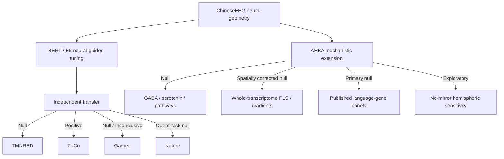

# 3. Results and Comparisons

**Last updated:** 2026-08-27

This file is the current numerical results summary for NeuroSem. It separates EEG reliability, neural-model correspondence, model tuning, external semantic benchmarks, independent EEG transfer, same-participant/new-text validation, and the completed AHBA mechanistic extension.

## Cross-dataset evidence table

| Dataset / test | Role | Frozen EEG reliability | Frozen model-transfer result | Interpretation |
|---|---|---|---|---|
| ChineseEEG Little Prince | Development dataset | temporal-mean residual LOO ~**0.121** | BERT run-07 neural-guided > text-only in two seeds | Establishes development neural geometry and within-dataset neural-guided learning |
| TMNRED | Independent Chinese reading | `row_mean_all` **0.00724**, 95% CI **[0.00356, 0.01079]** | E5 lambda .10 - 0 = **+0.000020**, p=.402 | Geometry replicates weakly; transfer null |
| ZuCo 2.0 Task 1 NR | Independent English reading | `row_mean_all` **0.06742**, 95% CI **[0.05831, 0.07687]**, 17/17 positive | E5 lambda .10 - 0 = **+0.001664**, 17/17 positive, p=`7.63e-06` | Strong cross-language geometry replication and positive frozen transfer |
| ChineseEEG Garnett Dream | Same participants, new narrative | `row_mean_all` **0.01863**, 95% CI **[0.01636, 0.02085]**, 10/10 positive | E5 lambda .10 - 0 = **+0.0003266**, p=.1016 | Neural geometry generalizes; model-transfer advantage null/inconclusive |
| Nature directional | Out-of-task inner speech | not treated as task-matched reading reliability | lambda .10 - 0 ~**-0.001786** | Out-of-task null boundary condition |
| AHBA transcriptomics | Population postmortem mechanistic extension | N/A | primary molecular tests null | No specific molecular mechanism established |

## Evidence map

# 3.1 ChineseEEG neural geometry and BERT correspondence

The selected whole-row temporal-mean EEG representation was chosen on neural reliability before semantic testing.

Primary reliability:

- raw LOO approximately **0.220**;
- nuisance-residualized LOO approximately **0.121**.

Held-out Little Prince runs 01-06 showed small but consistently positive BERT final-layer residual neural-semantic correspondence:

| Run | Mean partial-Spearman |
|---|---:|
| 01 | 0.0057 |
| 02 | 0.0034 |
| 03 | 0.0145 |
| 04 | 0.0045 |
| 05 | 0.0174 |
| 06 | 0.0056 |

Cross-run summary:

- positive in **6/6** runs;
- mean run effect **0.0085**;
- exact one-sided run-level sign-flip **p = 0.015625**.

# 3.2 BERT neural-guided tuning: sealed run-07

| Arm | Seed 1 | Seed 2 |
|---|---:|---:|
| Base | 0.0319 | 0.0319 |
| Text-only | 0.0354 | 0.0341 |
| Neural-guided | **0.0371** | **0.0375** |
| Shuffled-neural | 0.0353 | 0.0338 |

Interpretation: brain-guided training can improve alignment to held-out ChineseEEG neural geometry relative to matched controls.

# 3.3 Generic semantic benchmark

Seed 1 eight-task mean Spearman:

- base 0.283464;
- text-only 0.308486;
- neural-guided 0.308575;
- shuffled-neural 0.307943.

Seed 2:

- base 0.283464;
- text-only 0.305020;
- neural-guided 0.301607;
- shuffled-neural 0.305266.

Interpretation: no stable neural-specific generic semantic advantage.

# 3.4 Multilingual-E5 replication

Multilingual E5 reproduced the qualitative within-ChineseEEG neural-target alignment phenomenon. Pareto work showed that neural alignment and generic semantic performance can trade off.

The primary external contrast used across TMNRED, ZuCo, Nature, and Garnett was neural-guided lambda 0.10 versus matched text-only lambda 0.

# 3.5 TMNRED

Primary `row_mean_all` reliability:

- mean residual LOO **0.00724**;
- 95% CI **[0.00356, 0.01079]**.

Frozen E5 transfer:

- mean delta **+0.000020**;
- median **+0.000053**;
- 95% CI **[-0.000128, +0.000176]**;
- one-sided sign-flip **p = 0.402**.

Exploratory alternative targets did not rescue transfer.

Interpretation: geometry replicates weakly, but neural-guided transfer is null.

# 3.6 Nature directional-word dataset

Frozen covert/inner-speech lambda .10 - 0 mean difference approximately **-0.001786** with no positive transfer evidence.

Interpretation: out-of-task boundary condition, not a task-matched reading refutation.

# 3.7 ZuCo 2.0 English reading

## EEG-only reliability

Primary `row_mean_all`:

- mean raw LOO **0.06739**;
- mean residual LOO **0.06742**;
- median **0.06559**;
- 95% CI **[0.05831, 0.07687]**;
- **17/17** participants positive;
- one-sided exact sign-flip **p = 7.63e-06**.

## Frozen E5 transfer

- mean participant delta **+0.0016637**;
- median **+0.0014871**;
- **17/17** positive;
- 95% CI **[+0.0012294, +0.0021452]**;
- one-sided exact sign-flip **p = 7.63e-06**;
- two-sided **p = 1.53e-05**.

Interpretation: positive task-matched transfer of neural alignment from ChineseEEG to independent English natural-reading EEG.

# 3.8 ChineseEEG Garnett Dream

## EEG-only reliability

Primary `row_mean_all`:

- raw mean LOO **0.03545**;
- nuisance-residualized mean LOO **0.01863**;
- median **0.01895**;
- **10/10** positive;
- 95% CI **[0.01636, 0.02085]**;
- one-sided exact sign-flip **p = 0.0009766**.

The exact presentation-row to segmented-text mapping was frozen across 18 chapters, totaling **9,047** linguistic items.

## Frozen E5 transfer

Contrast: ChineseEEG-trained multilingual-E5 lambda .10 neural-guided minus lambda 0 text-only; chapters analyzed separately; full nuisance family restored.

- mean participant delta **+0.0003266**;
- median **+0.0003319**;
- **6/10** positive;
- 95% CI **[-0.0001218, +0.0007560]**;
- one-sided exact sign-flip **p = 0.1015625**;
- two-sided **p = 0.203125**.

Interpretation: confirmatory null/inconclusive. Neural geometry generalizes to the new narrative, but the neural-guided model advantage does not generalize convincingly.

# 3.9 AHBA spatial and transcriptomic preparation

The final model-blind pipeline froze:

- 128-channel dataset-provided CapTrak geometry;
- fsaverage ico-5 source space;
- three-layer BEM;
- explicit rigid registration;
- average reference;
- fixed surface-normal orientation;
- absolute lead-field sensitivity;
- per-channel L1 normalization;
- DK68 cortical mapping;
- `abagen 0.1.3` preprocessing;
- primary left-to-right mirroring with no-mirror sensitivity.

Primary AHBA expression retained **15,677 genes**; no-mirror retained **15,633**.

# 3.10 Frozen AHBA GABA/serotonin association

Seven primary mechanistic sets were tested against the frozen semantic channel-contribution pattern.

| Gene set | Mean rho | Exact p | Random-set p | BH q |
|---|---:|---:|---:|---:|
| GABA-A receptors | 0.0398 | 0.695 | 0.586 | 0.695 |
| GABA-B receptors | 0.0560 | 0.594 | 0.259 | 0.695 |
| GABA machinery | -0.0497 | 0.621 | 0.369 | 0.695 |
| Serotonin receptors | 0.0370 | 0.613 | 0.611 | 0.695 |
| Serotonin machinery | 0.0542 | 0.523 | 0.246 | 0.695 |
| Reactome GABA | 0.0456 | 0.684 | 0.411 | 0.695 |
| Reactome serotonin | 0.0372 | 0.500 | 0.591 | 0.695 |

Interpretation: no prespecified neurochemical/pathway system reliably explains the semantic spatial contribution pattern.

# 3.11 Exploratory whole-transcriptome AHBA

PLS1:

- observed score-phenotype Pearson **r = 0.4574**;
- `R^2 = 0.2092`;
- 5,000 hemisphere-constrained spatial rotations;
- two-sided spatial **p = 0.2745**.

No transcriptomic gradient survived FDR. Gradient 10 was closest nominally (`rho = 0.2256`, `p = 0.0566`, `q = 0.4747`).

Five valid donor LODO runs showed stable PLS gene-weight rankings (approximately 0.95-0.98), which demonstrates ranking stability but not significance.

Interpretation: exploratory whole-transcriptome spatial discovery is null after spatial correction.

# 3.12 Independent published language-gene panels

Two exact Wong et al. 2024 panels were frozen independently of NeuroSem outcomes.

## Six-gene structural-connectivity panel

Genes: `BHLHE22, COL5A2, NELL2, RYR3, SLIT1, SLIT2`.

Primary mirrored result:

- `rho = -0.1515`;
- spatial p=`0.4631`;
- size-matched gene p=`0.3863`;
- co-expression-profile p=`0.3889`;
- jointly supported: **false**.

## Fourteen-gene dyslexia panel

Primary mirrored result:

- `rho = -0.2733`;
- spatial p=`0.0516`, BH q=`0.1032`;
- size-matched gene p=`0.1018`, BH q=`0.2036`;
- co-expression-profile p=`0.0990`, BH q=`0.1980`;
- jointly supported: **false**.

Interpretation: suggestive negative trend but primary validation null.

# 3.13 No-mirror sensitivity and mirroring diagnostic

No-mirror dyslexia sensitivity:

- `rho = -0.4776`;
- spatial p=`0.00320`;
- size-matched gene p=`0.00120`;
- co-expression-profile gene p=`0.00100`.

This cannot rescue the null primary mirrored result.

A post-hoc diagnostic showed the difference is not caused by parcel support. Both analyses had all 68 parcels.

Hemisphere decomposition:

| Subset | Mirrored rho | No-mirror rho | Difference |
|---|---:|---:|---:|
| Full 68 | -0.2733 | -0.4776 | -0.2043 |
| Left hemisphere | -0.5670 | -0.5804 | -0.0134 |
| Right hemisphere | +0.0038 | -0.4310 | -0.4348 |

Interpretation: the no-mirror boost is driven primarily by a right-hemisphere expression-map shift. This is an exploratory methodological/hemispheric sensitivity, not confirmatory molecular evidence.

# 3.14 Joint interpretation

### Claim A: reproducible reading-related EEG geometry exists

**Supported.** ChineseEEG, TMNRED, ZuCo, and Garnett reliability all support this at different effect sizes.

### Claim B: neural-guided training improves held-out development EEG alignment

**Supported.** BERT run-07 improvements replicated across two seeds; E5 reproduced the qualitative effect.

### Claim C: neural-guided training improves generic semantics

**Not supported.** Generic benchmark improvements are unstable and not neural-specific.

### Claim D: neural-guided alignment transfer generalizes to independent reading EEG

**Supported in ZuCo, not universal.** TMNRED and Garnett transfer are null/inconclusive.

### Claim E: a specific transcriptomic mechanism explains the semantic neural geometry

**Not supported.** Prespecified neurochemical systems, whole-transcriptome spatial discovery, and independent published language panels all fail the frozen primary inferential framework.

### Claim F: AHBA bilateral preprocessing matters

**Supported as a post-hoc sensitivity observation.** The no-mirror dyslexia-panel result is substantially stronger because of a right-hemisphere expression-map shift, but this requires independent validation because AHBA right-hemisphere sampling is sparse.

The manuscript should therefore preserve the positive cross-dataset neural-geometry evidence, the selective ZuCo transfer success, the TMNRED/Garnett/Nature null boundaries, and the AHBA mechanistic nulls without significance-chasing.
