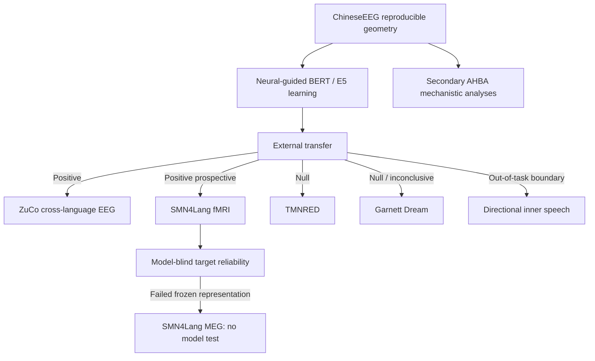

# 3. Results and Comparisons

**Last updated:** 2026-08-28

This file is the current numerical results summary for NeuroSem. The evidence hierarchy is scientific rather than chronological: development neural geometry, learnability by neural-guided training, independent neural transfer, prospective cross-modal transfer, transfer and reliability boundaries, and secondary mechanistic analyses.

## Cross-dataset evidence table

| Dataset / test | Role | Frozen neural reliability | Frozen model-transfer result | Interpretation |
|---|---|---|---|---|
| ChineseEEG Little Prince | Development EEG | residual LOO ~**0.121** | sealed BERT run-07 neural-guided > text-only and shuffled-neural in two seeds | Reproducible target and learnability |
| ZuCo 2.0 Task 1 NR | Independent English reading EEG | **0.06742**, 95% CI **[0.05831,0.07687]**, 17/17 positive | E5 lambda .10 - 0 = **+0.0016637**, 95% CI **[+0.0012294,+0.0021452]**, 17/17 positive, p=`7.63e-06` | Strong cross-language EEG transfer |
| SMN4Lang fMRI | Independent Mandarin auditory narratives | **0.65327**, 95% CI **[0.63945,0.66843]**, 12/12 positive | E5 lambda .10 - 0 = **+0.00085250**, 95% CI **[+0.00078966,+0.00091398]**, 12/12 positive, p=`0.00024414` | Strongest prospective cross-modal validation |
| TMNRED | Independent Chinese reading EEG | **0.00724**, 95% CI **[0.00356,0.01079]** | **+0.000020**, p=.402 | Weak geometry replication; transfer null |
| ChineseEEG Garnett Dream | Same-participant/new-text EEG | **0.01863**, 95% CI **[0.01636,0.02085]**, 10/10 positive | **+0.0003266**, 95% CI crosses zero, 6/10 positive, p=.1016 | Geometry generalizes; transfer null/inconclusive |
| Directional inner speech | Out-of-task EEG boundary | not treated as task-matched reading reliability | lambda .10 - 0 ~**-0.001786** | Out-of-task null/negative boundary |
| SMN4Lang MEG | Model-blind reliability boundary | prospective 32-bin mean **0.007713**, 95% CI **[-0.007627,+0.021655]**, p=.16870 | **not evaluated** because gate failed | Reliability boundary, not negative transfer |
| AHBA transcriptomics | Secondary mechanistic extension | N/A | primary molecular tests null | No specific molecular mechanism established |

## Evidence map

## 3.1 ChineseEEG development geometry and neural-guided learning

The whole-row temporal-mean EEG representation was selected using neural reliability before semantic testing.

- raw LOO reliability approximately **0.220**;
- nuisance-residualized LOO approximately **0.121**.

Held-out Little Prince runs 01-06 showed final-layer BERT residual neural-model correspondence of 0.0057, 0.0034, 0.0145, 0.0045, 0.0174 and 0.0056. All six effects were positive, mean **0.0085**, exact one-sided run-level sign-flip **p = 0.015625**.

Sealed run-07 BERT residual neural alignment:

| Arm | Seed 1 | Seed 2 |
|---|---:|---:|
| Base | 0.0319 | 0.0319 |
| Text-only | 0.0354 | 0.0341 |
| Neural-guided | **0.0371** | **0.0375** |
| Shuffled-neural | 0.0353 | 0.0338 |

Multilingual E5 reproduced the qualitative neural-guided alignment phenomenon. The frozen external contrast carried forward was neural-guided lambda 0.10 versus matched text-only lambda 0.

Generic eight-task semantic benchmarks showed no stable neural-specific advantage, so neural alignment and generic semantic quality are treated as distinct outcomes.

## 3.2 ZuCo 2.0 cross-language EEG transfer

Primary all-retained-channel temporal-mean reliability:

- mean residual LOO **0.06742**;
- median **0.06559**;
- 95% CI **[0.05831,0.07687]**;
- **17/17** positive;
- exact one-sided sign-flip **p = 7.63e-06**.

Frozen E5 transfer:

- mean participant delta **+0.0016637**;
- median **+0.0014871**;
- **17/17** positive;
- 95% CI **[+0.0012294,+0.0021452]**;
- exact one-sided **p = 7.63e-06**.

Interpretation: positive transfer from ChineseEEG neural guidance to independent English natural-reading EEG without target-dataset model tuning.

## 3.3 SMN4Lang fMRI prospective cross-modal validation

SMN4Lang/OpenNeuro `ds004078` was designated prospectively for cross-modal validation. The fMRI neural target passed a model-blind reliability gate before E5 model evaluation.

Primary representation:

- 12 participants, 60 stories, 720 participant-story runs;
- TR **0.710 s**;
- independently published LanA language-network mask at probability threshold **0.20**;
- **25,137** retained voxels;
- correlation-distance story RDMs;
- nuisance control for temporal separation, HRF-convolved word-onset density and HRF-convolved acoustic RMS envelope.

Reliability:

- mean residual LOO **0.65327**;
- median **0.64760**;
- **12/12** positive;
- 95% CI **[0.63945,0.66843]**;
- exact one-sided **p = 0.00024414**.

Frozen E5 transfer:

- lambda 0 text-only mean RSA **0.12092396**;
- lambda 0.10 neural-guided mean RSA **0.12177646**;
- mean delta **+0.00085250**;
- median **+0.00086365**;
- **12/12** positive;
- 95% CI **[+0.00078966,+0.00091398]**;
- exact one-sided **p = 0.00024414**.

No SMN4Lang training, layer search, lambda search, checkpoint search, ROI search, lag/HRF search or semantic-unit search occurred from the fMRI outcome.

Interpretation: a small but highly consistent prospective cross-modal representational advantage in different participants during naturalistic auditory comprehension.

## 3.4 Transfer boundary conditions

### TMNRED

- residual LOO reliability **0.00724**, 95% CI **[0.00356,0.01079]**;
- frozen E5 mean delta **+0.000020**;
- median **+0.000053**;
- 95% CI **[-0.000128,+0.000176]**;
- one-sided **p = 0.402**.

Bounded exploratory alternative targets did not recover convincing transfer.

### ChineseEEG Garnett Dream

- residual mean LOO **0.01863**;
- median **0.01895**;
- **10/10** positive;
- 95% CI **[0.01636,0.02085]**;
- exact one-sided reliability **p = 0.0009766**.

Frozen E5 transfer:

- mean delta **+0.0003266**;
- median **+0.0003319**;
- **6/10** positive;
- 95% CI **[-0.0001218,+0.0007560]**;
- one-sided **p = 0.1015625**.

Interpretation: the neural geometry generalizes to the new narrative, but the model-transfer advantage does not generalize convincingly.

### Directional inner speech

Frozen covert/inner-speech lambda .10 - 0 mean difference is approximately **-0.001786** with no positive transfer evidence. This is an out-of-task boundary, not a task-matched reading refutation.

## 3.5 SMN4Lang MEG reliability boundary

The prospective primary representation used released preprocessed 1-40 Hz sensor-level MEG, bad-sample exclusion, all retained magnetometers and planar gradiometers, 32 normalized-time RMS bins per sensor type, separate within-type z-scoring and correlation-distance story RDMs.

Primary 32-bin reliability:

- mean LOO **0.0077130472**;
- median **0.0113200737**;
- **7/12** positive;
- 95% participant-bootstrap CI **[-0.0076270592,+0.0216547942]**;
- exact one-sided sign-flip **p = 0.168701171875**;
- gate pass: **false**.

Because the model-blind reliability gate failed, **no model evaluation was performed**.

A separately frozen post-confirmatory temporal-granularity family tested only 4, 8 and 16 bins with the same sensor-level RMS representation family. Familywise pass required positive mean, 98.3333% bootstrap CI above zero and exact one-sided p < 0.0166667.

- 4 bins: mean **0.0153387454**, familywise CI **[-0.0058580491,+0.0383515355]**, p **0.06982421875**, fail.
- 8 bins: mean **0.0054803606**, familywise CI **[-0.0102620453,+0.0258413310]**, p **0.2890625**, fail.
- 16 bins: mean **0.0081749608**, familywise CI **[-0.0080561266,+0.0237761472]**, p **0.128662109375**, fail.

No candidate passed and no E5 evaluation was opened. The branch is scientifically closed for the present manuscript. This is a representation-specific **reliability boundary**, not a negative transfer result.

## 3.6 AHBA mechanistic extension

Primary AHBA expression retained **15,677 genes**; the no-mirror sensitivity retained **15,633**. Seven prespecified GABAergic/serotonergic/pathway sets were null. Exploratory whole-transcriptome PLS1 showed in-sample `r = 0.4574`, `R^2 = 0.2092`, but failed hemisphere-constrained spatial inference (`p = 0.2745`). No transcriptomic gradient survived FDR. Two independently frozen published language-gene panels were primary-null. The stronger no-mirror dyslexia-panel result (`rho = -0.4776`, spatial `p = 0.00320`) remains exploratory and cannot revise the mirrored primary null.

Interpretation: no confirmatory molecular mechanism has been established.

## 3.7 Joint interpretation

- **Reproducible neural geometry:** supported across multiple EEG datasets and strongly in SMN4Lang fMRI.
- **Learnability:** supported within ChineseEEG under sealed evaluation.
- **External transfer:** supported selectively by ZuCo cross-language EEG and SMN4Lang prospective fMRI.
- **Universality:** not supported; TMNRED, Garnett and directional inner speech are explicit boundaries.
- **MEG transfer:** not tested because the frozen neural target failed its reliability prerequisite.
- **Generic semantic improvement:** not supported.
- **Specific transcriptomic mechanism:** not supported.

The main manuscript should remain centered on **transferable neural relational constraints with explicit reliability and transfer boundaries**. Raw RSA values across EEG, fMRI and MEG must not be treated as a common effect-size scale.
