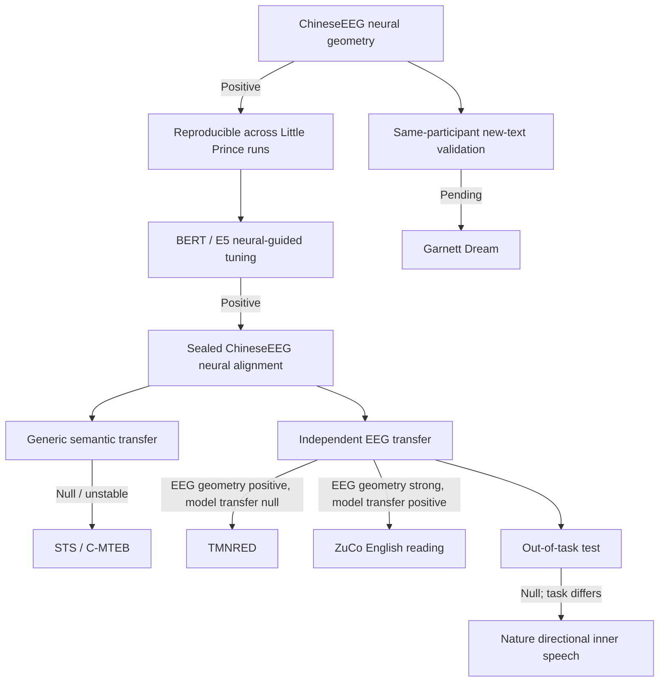

# 3. Results and Comparisons

**Last updated:** 2026-08-26

This file is the current numerical results summary for NeuroSem. It separates EEG reliability, neural-model correspondence, model tuning, external semantic benchmarks, and independent EEG transfer.

## Cross-dataset evidence table

| Dataset / test | Task / language | Independence from Little Prince development set | Frozen EEG reliability | Frozen model-transfer result | Interpretation |
|---|---|---|---|---|---|
| ChineseEEG Little Prince | Silent natural reading / Chinese | Development dataset | temporal-mean residual LOO ~**0.121** | BERT run-07 neural-guided > text-only in two seeds; E5 qualitative architecture replication | Establishes development neural geometry and within-dataset neural-guided learning |
| TMNRED | Sentence reading / Chinese | Independent participants + dataset | primary temporal mean **0.00724**, 95% CI **[0.00356, 0.01079]** | E5 lambda .10 - 0 = **+0.000020**, 95% CI **[-0.000128, +0.000176]**, p=.402 | Geometry replicates weakly; neural-guided transfer null |
| ZuCo 2.0 Task 1 NR | Normal reading / English | Independent participants + dataset + language | primary temporal mean **0.06742**, 95% CI **[0.05831, 0.07687]**, 17/17 positive | E5 lambda .10 - 0 = **+0.001664**, 95% CI **[+0.001229, +0.002145]**, 17/17 positive, one-sided p=**7.63e-06** | Strong cross-language reading replication and positive frozen transfer |
| Nature directional | Covert directional concepts / Russian + Spanish | Independent participants + dataset + task | not treated as task-matched reading reliability | lambda .10 - 0 mean **-0.001786**, null | Out-of-task boundary condition; does not directly test natural reading |
| ChineseEEG Garnett Dream | Silent natural reading / Chinese | Same participants, new text | pending | pending | Prospective same-participant/new-text validation |

The key pattern is not universal transfer. Reading-related geometry generalizes across independent Chinese and English reading datasets, but the neural-guided model advantage transfers convincingly only in the task-matched ZuCo English-reading test so far.

## Evidence map

## 3.1 ChineseEEG neural geometry and BERT correspondence

The initial flattened sensor-time representation had weak cross-subject reliability. A simpler whole-row temporal-mean representation was selected based on neural reliability before semantic testing.

For the selected row-mean representation:

- raw leave-one-subject-out cross-subject reliability: approximately **0.220**;
- after nuisance control: approximately **0.121**;
- residual reliability above circular-shift null: approximately **p = 0.001**.

Held-out Little Prince runs 01-06 showed small but consistently positive BERT final-layer residual neural-semantic correspondence:

| Run | Mean partial-Spearman | Run permutation p |
|---|---:|---:|
| 01 | 0.0057 | 0.051 |
| 02 | 0.0034 | 0.083 |
| 03 | 0.0145 | 0.00060 |
| 04 | 0.0045 | 0.110 |
| 05 | 0.0174 | 0.040 |
| 06 | 0.0056 | 0.083 |

Cross-run summary:

- positive primary effect in **6/6** runs;
- mean run effect = **0.0085**;
- exact one-sided run-level sign-flip **p = 0.015625**;
- common-subject aggregate positive in **8/9** subjects;
- exact subject-level sign-flip **p = 0.0391**.

## 3.2 BERT neural-guided tuning: sealed run-07

Run-07 mean partial-Spearman:

| Arm | Seed 1 | Seed 2 |
|---|---:|---:|
| Base | 0.0319 | 0.0319 |
| Text-only | 0.0354 | 0.0341 |
| Neural-guided | **0.0371** | **0.0375** |
| Shuffled-neural | 0.0353 | 0.0338 |

Interpretation: brain-guided training can improve alignment to held-out ChineseEEG neural geometry relative to matched text-only and shuffled-neural controls.

## 3.3 Generic external semantic benchmark

Seed 1 eight-task mean Spearman:

- base 0.283464;
- text-only 0.308486;
- neural-guided 0.308575;
- shuffled-neural 0.307943.

Seed 2:

- base 0.283464;
- text-only 0.305020;
- neural-guided 0.301607;
- shuffled-neural 0.305266.

Interpretation: neural-guided tuning does not show a stable neural-specific advantage on generic semantic benchmarks.

## 3.4 Multilingual-E5 replication

Multilingual E5 reproduced the qualitative within-ChineseEEG neural-target alignment phenomenon, showing that the effect is not only a BERT-specific implementation artifact. Pareto/dose-response work showed that neural alignment and generic semantic performance can trade off rather than improve together.

The primary external E5 contrast subsequently frozen for TMNRED, Nature, and ZuCo was neural-guided lambda 0.10 versus matched text-only lambda 0.

## 3.5 TMNRED EEG-only replication

Frozen cohort: 29 participants, eight sessions, 50 high-coverage sentence items in every session.

| Representation | Mean residual LOO reliability | Positive participants | Interpretation |
|---|---:|---:|---|
| `row_mean_all` | **0.00724** | 75.9% | Prospectively designated primary representation replicates weakly but positively |
| `row_std_all` | **0.01820** | 89.7% | Stronger secondary reliability in TMNRED |
| `relative_8bin_all` | **0.01148** | secondary | Reliable secondary temporal representation |

For `row_mean_all`, bootstrap 95% CI = **[0.00356, 0.01079]**.

## 3.6 TMNRED frozen E5 transfer

Primary contrast: ChineseEEG-trained E5 lambda 0.10 neural-guided versus lambda 0 text-only, no TMNRED tuning.

- mean residual-RSA difference = **+0.000020**;
- median difference = **+0.000053**;
- positive participants = **55.2%**;
- bootstrap 95% CI = **[-0.000128, +0.000176]**;
- one-sided sign-flip **p = 0.402**.

Exploratory alternative-target follow-ups did not rescue transfer:

- SD target: delta **-0.000294**, 95% CI **[-0.000479, -0.000107]**, p=.997;
- relative-8-bin target: delta **+0.000041**, 95% CI **[-0.000111, +0.000207]**, p=.322.

Interpretation: TMNRED neural geometry is reproducible, but the ChineseEEG-trained neural-guided E5 advantage does not transfer detectably there.

## 3.7 Nature directional-word dataset

The Nature directional dataset is an out-of-task test because its primary NeuroSem condition is covert/inner speech rather than reading.

Frozen lambda .10 - 0 mean difference was approximately **-0.001786**, with no evidence of a positive transfer effect. This should be treated as a boundary condition, not as a task-matched refutation of reading-related neural geometry.

## 3.8 ZuCo 2.0 structural freeze

Public ZuCo 2.0 Task 1 NR contained 18 participants x 7 runs. Model-blind QC froze 17 participants with all seven runs structurally ready; YTL was excluded before outcome analysis because NR3, NR4, and NR6 failed structural event checks.

Sentence counts by run were 50, 50, 51, 50, 50, 49, 49 = 349 total.

The task-material mapping was frozen without EEG-signal or model outcomes: a unique zero-cost monotonic word-count alignment mapped EEG sentence order to public task-material rows while skipping rows 1-3 in every run.

## 3.9 ZuCo EEG-only reliability

Primary representation: `row_mean_all`, inherited prospectively from ChineseEEG and tested model-blind before model transfer.

Results:

- mean raw LOO reliability = **0.06739**;
- mean nuisance-residualized LOO reliability = **0.06742**;
- median residualized LOO = **0.06559**;
- bootstrap 95% CI = **[0.05831, 0.07687]**;
- **17/17 participants positive**;
- exact one-sided sign-flip **p = 7.63e-06**;
- exact two-sided sign-flip **p = 1.53e-05**.

Sensitivity representations were also positive:

- `row_std_all` residual LOO about **0.04087**;
- `relative_8bin_all` residual LOO about **0.04682**.

Interpretation: the prospectively inherited temporal-mean representation replicates strongly in independent English natural reading and is stronger than the two predeclared sensitivities on this dataset.

## 3.10 ZuCo frozen E5 transfer

The sole confirmatory transfer contrast was ChineseEEG-trained multilingual-E5 neural-guided lambda 0.10 minus matched text-only lambda 0 on the frozen ZuCo temporal-mean target. There was no ZuCo tuning, representation selection, subject selection, item selection, model selection, or lambda selection from transfer outcomes.

Results:

- mean participant delta = **+0.0016637**;
- median delta = **+0.0014871**;
- **17/17 participants positive**;
- bootstrap 95% CI = **[+0.0012294, +0.0021452]**;
- exact one-sided sign-flip **p = 7.63e-06**;
- exact two-sided sign-flip **p = 1.53e-05**.

Interpretation: this is positive evidence that a modest amount of neural guidance learned from ChineseEEG transfers its neural-alignment advantage to an independent English natural-reading EEG dataset.

The first RunRelay attempt failed immediately with `ModuleNotFoundError: No module named 'scripts'`. The rerun changed only Python import-path handling; the scientific protocol, frozen contrast, cohort, representation, and inference were unchanged.

## 3.11 ChineseEEG Garnett Dream status

No Garnett Dream outcome has yet been incorporated into the core evidence chain.

Its correct role is **same-participant / new-text validation**. Before any outcome is inspected, the analysis should freeze the Little Prince temporal-mean representation, nuisance-control family, participant/item QC rules, and RSA/inference conventions as far as the Garnett Dream file structure permits.

## 3.12 Joint interpretation

### Claim A: reproducible reading-related EEG geometry exists

**Supported.** ChineseEEG provides strong development evidence, TMNRED provides weak but positive independent Chinese-reading replication, and ZuCo provides substantially stronger independent English-reading replication.

### Claim B: brain-guided training can improve held-out alignment to the development EEG target

**Supported.** BERT run-07 improvements reproduced across two seeds, and E5 reproduced the qualitative phenomenon.

### Claim C: brain-guided training improves generic semantic representations

**Not supported.** Generic semantic benchmark gains are unstable and not neural-specific.

### Claim D: brain-guided training can transfer its neural-alignment advantage to an independent reading EEG dataset

**Supported in ZuCo, not universal.** The frozen ZuCo result is positive and highly consistent across all 17 participants, whereas the frozen TMNRED transfer is null and the out-of-task Nature directional test is null/negative.

The manuscript should therefore claim **task-matched cross-dataset neural-alignment transfer in English reading**, not universal semantic improvement or universal EEG transfer.
