# 4. Experiment Ledger

**Last updated:** 2026-08-26

This is the chronological audit trail for major NeuroSem analyses. It records what was run, why it was run, whether it was confirmatory or exploratory, and what changed afterward. Exact code/configuration should be recovered from the NeuroSem commit associated with each RunRelay job.

## Project chronology at a glance

```mermaid
flowchart LR
    A[ChineseEEG audit] --> B[EEG representation selection]
    B --> C[BERT residual RSA]
    C --> D[BERT neural-guided tuning]
    D --> E[Sealed run-07 evaluation]
    E --> F[External semantic benchmark]
    F --> G[E5 architecture replication]
    G --> H[E5 Pareto exploration]
    H --> I[Nature directional validation]
    I --> J[TMNRED EEG reliability]
    J --> K[TMNRED E5 transfer]
    K --> L[ZuCo audit / structural freeze]
    L --> M[ZuCo EEG reliability]
    M --> N[ZuCo frozen E5 transfer]
    N --> O[Garnett structural freeze]
    O --> P[Garnett EEG reliability]
    P --> Q[Garnett exact row-text mapping]
    Q --> R[Garnett frozen E5 transfer pending]
    N --> S[AHBA model-blind mechanistic preparation]
```

## Ledger conventions

- **Confirmatory / frozen**: key analysis choices were fixed before target outcomes were inspected.
- **Exploratory**: motivated by earlier results and not promoted to primary evidence without independent replication.
- Failed jobs are retained when they expose an engineering/data constraint or demonstrate that no scientific choice changed after failure.
- Safe derived artifacts are transported through Google Drive; raw/restricted neural data are not declared artifacts.

## Phase A. ChineseEEG discovery and BERT tuning

### EEG representation selection

The early flattened sensor-time representation had weak cross-subject reliability. A simpler temporal mean within each channel was selected on neural reliability before semantic testing.

Selected representation: approximately 0.220 raw LOO reliability and approximately 0.121 after nuisance control, with residual reliability above the circular-shift null.

### BERT semantic RSA, Little Prince runs 01-06

Purpose: test residual correspondence between BERT geometry and reproducible EEG geometry after nuisance control.

Result: positive in 6/6 runs; mean run effect 0.0085; exact run-level sign-flip p=0.015625.

### BERT neural-guided tuning and sealed run-07

Four arms: base, text-only, neural-guided, shuffled-neural.

Run-07 mean partial-Spearman:

- seed 1: 0.0319 / 0.0354 / **0.0371** / 0.0353;
- seed 2: 0.0319 / 0.0341 / **0.0375** / 0.0338.

Interpretation: neural-guided arm strongest on the sealed neural holdout in two seeds.

### Generic semantic benchmark

Seed 1 eight-task mean: base 0.283464, text-only 0.308486, neural-guided 0.308575, shuffled 0.307943.

Seed 2: base 0.283464, text-only 0.305020, neural-guided 0.301607, shuffled 0.305266.

Interpretation: no stable neural-specific generic semantic gain.

## Phase B. Multilingual-E5 architecture replication

### `NEUROSEM-E5-REP-0001`

Malformed control job: `requested_machine_id` was null. Never reuse as template/evidence.

### `NEUROSEM-E5-REP-0002`

Failed; infrastructure/debugging only.

### `NEUROSEM-E5-REP-0003`

Completed. Purpose: independent-architecture replication of neural-guided tuning with multilingual E5.

Interpretation: qualitative ChineseEEG neural-target alignment effect reproduced in a second architecture.

### E5 Pareto work

`NEUROSEM-E5-PARETO-0001` failed during exploratory infrastructure work.

`NEUROSEM-E5-PARETO-EVAL-0001` completed and evaluated already-trained dose-response points without retraining.

Interpretation: neural alignment and generic semantic performance do not simply improve together. Treat Pareto work as exploratory.

## Phase C. Nature directional-word dataset

Completed download, model-blind audit, event probing, and frozen directional-word validation.

Primary covert/inner-speech lambda .10 - 0 mean difference was approximately -0.001786; no positive transfer evidence.

Interpretation: out-of-task boundary condition, not a task-matched natural-reading replication.

## Phase D. ChineseEEG representation refinement

`NEUROSEM-EEGREP-AUDIT-0001` completed a model-blind inventory.

Subsequent overnight/spectral-phase jobs exposed missing/untracked assets and incomplete common-subject materialization. The established temporal mean remained the primary representation; richer families remain secondary/exploratory unless prospectively validated elsewhere.

## Phase E. TMNRED independent Chinese-reading replication

A sequence of download, documentation, event-alignment, format, stimulus, and materialization probes established a prospective frozen cohort/item rule before signal-level outcome analysis.

### Frozen input cohort

`NEUROSEM-TMNRED-INPUTS-0006` completed with:

- 29 participants;
- 8 sessions;
- all 50 sentence items retained per session under the >=80% participant-coverage rule.

### `NEUROSEM-TMNRED-PRIMARY-RELIABILITY-0001`

Type: frozen/model-blind EEG-only replication.

- `row_mean_all`: residual LOO 0.00724, 95% CI [0.00356, 0.01079], 75.9% positive;
- `row_std_all`: 0.01820;
- `relative_8bin_all`: 0.01148.

### `NEUROSEM-TMNRED-E5-TRANSFER-0001`

Type: frozen confirmatory external model-transfer test.

Primary contrast: ChineseEEG-trained E5 lambda 0.10 neural-guided vs lambda 0 text-only, no TMNRED tuning.

Result: mean delta +0.000020, 95% CI [-0.000128, +0.000176], one-sided p=.402, 55.2% positive.

Interpretation: null transfer.

### `NEUROSEM-TMNRED-E5-ALTREP-0001`

Type: explicitly exploratory post-confirmatory analysis.

- SD target: delta -0.000294, 95% CI [-0.000479, -0.000107], p=.997;
- 8-bin target: delta +0.000041, 95% CI [-0.000111, +0.000207], p=.322.

Interpretation: alternative TMNRED targets do not rescue transfer.

## Phase F. ZuCo 2.0 independent English-reading replication

### Inventory and format probing

`NEUROSEM-ZUCO-OSF-INVENTORY-0001` completed. Decision: prioritize ZuCo 2.0 Task 1 Normal Reading.

Early format jobs established MATLAB v7.3/HDF5 handling and continuous EEG event structure.

Representative YDG NR1: 105 channels, 500 Hz, 50 sentence units, 110 events, with sentence windows delimited by `10 -> 11` or `12 -> 13` pairs.

### Full-cohort materialization

`NEUROSEM-ZUCO2-NR-INPUTS-0001` completed but was unusable because the initial filename matcher only accepted the `gip_` prefix.

The corrected matcher accepted alphabetic prefixes, and `NEUROSEM-ZUCO2-NR-INPUTS-0002` completed successfully.

Frozen cohort:

- 18 subjects discovered;
- 126 expected/present run files;
- 123 runs structurally ready;
- 17 subjects ready across all seven runs;
- YTL excluded because NR3, NR4, and NR6 failed structural event QC.

YTL exclusion was frozen before outcome analysis.

### Stimulus mapping probes

A sequence of narrow, model-blind probes resolved the public Task 1 material schema and the exact 349-sentence mapping.

Important history:

- early probe design attempted unnecessary ET materialization and timed out;
- later probes established that `task_materials/nr_*.csv` files are semicolon-delimited and headerless;
- each material file contains three more rows than the EEG sentence count;
- no row was dropped based on outcome information;
- a unique zero-cost monotonic word-count alignment showed that rows 1-3 are skipped in every NR run and all remaining rows map one-to-one to EEG sentence order.

This mapping was frozen before EEG reliability.

### `NEUROSEM-ZUCO2-NR-RELIABILITY-0001`

Status: completed.

Type: prospectively frozen, model-blind EEG-only reliability analysis.

Primary `row_mean_all`:

- mean raw LOO 0.06739;
- mean nuisance-residualized LOO **0.06742**;
- median residualized LOO 0.06559;
- 95% CI **[0.05831, 0.07687]**;
- **17/17 participants positive**;
- exact one-sided sign-flip **p=7.63e-06**.

Frozen sensitivities:

- `row_std_all` residual LOO about 0.04087;
- `relative_8bin_all` residual LOO about 0.04682.

### `NEUROSEM-ZUCO2-NR-E5-TRANSFER-0001`

Status: failed immediately before any scientific outcome.

Reason: `ModuleNotFoundError: No module named 'scripts'` from direct script execution. No artifacts. The failure was purely a Python import-path issue.

Scientific protocol was not modified.

### `NEUROSEM-ZUCO2-NR-E5-TRANSFER-0002`

Status: completed.

Type: single frozen confirmatory cross-dataset/cross-language model-transfer test.

Contrast: ChineseEEG-trained multilingual-E5 lambda 0.10 neural-guided minus matched lambda 0 text-only, evaluated on the frozen ZuCo temporal-mean EEG geometry with no ZuCo tuning.

Result:

- mean participant delta **+0.0016637**;
- median delta **+0.0014871**;
- **17/17 participants positive**;
- bootstrap 95% CI **[+0.0012294, +0.0021452]**;
- exact one-sided sign-flip **p=7.63e-06**;
- exact two-sided sign-flip **p=1.53e-05**.

Interpretation: positive task-matched transfer of neural alignment from ChineseEEG to independent English reading EEG.

Guardrail: stop ZuCo lambda/representation/window/sensor searches after this confirmatory result.

## Phase G. ChineseEEG Garnett Dream

Role: **same-participant / new-text validation**, not independent-cohort replication.

### `NEUROSEM-GARNETT-STRUCTURE-PROBE-0001`

Completed. Model-blind inventory of Garnett files and participant/run structure.

Important follow-up: the first broad structure probe could over-include Little Prince files because both tasks use `task-reading`. Later probes explicitly restricted to `ses-GarnettDream`; no scientific outcome had been computed at that point.

### `NEUROSEM-GARNETT-ALIGNMENT-FREEZE-0001` and `0002`

Completed model-blind structural/event/text/materialization freeze work.

Frozen analysis unit: ordered `ROWS -> ROWE` presentation row within chapter/run.

Frozen event/source family: `derivatives/preproc/filtered_0.5_30`.

Sub-07's CH19 was not allowed to substitute post hoc for missing CH18.

### `NEUROSEM-GARNETT-INPUTS-0002`

Failed after long materialization because 171 BrainVision companion-reference checks detected the published internal typo `ses-GranettDream` versus tracked filename `ses-GarnettDream`.

The EEG files themselves materialized; the failure was validator-only. No EEG outcome was computed.

### `NEUROSEM-GARNETT-INPUTS-0003`

Completed after a narrow validator normalization of only the known `GranettDream -> GarnettDream` typo.

Frozen materialization summary:

- 10 participants;
- 171 valid participant-runs;
- 18 chapters;
- 85,865 participant x presentation-row records;
- zero failures;
- ready for reliability.

No EEG samples or model outcomes were loaded during materialization.

### `NEUROSEM-GARNETT-RELIABILITY-0001`

Status: completed.

Type: prospectively frozen EEG-only same-participant/new-text reliability test.

Primary `row_mean_all`:

- mean raw LOO reliability **0.03545**;
- mean nuisance-residualized participant LOO reliability **0.01863**;
- median residualized LOO **0.01895**;
- **10/10 participants positive**;
- participant-bootstrap 95% CI **[0.01636, 0.02085]**;
- exact one-sided sign-flip **p=0.0009766**;
- exact two-sided sign-flip **p=0.001953**.

Predeclared sensitivities:

- `row_std_all`: residual mean about **0.04443**, 10/10 positive;
- `relative_8bin_all`: residual mean about **0.00407**, 9/10 positive.

Interpretation: neural geometry generalizes to a substantially different narrative in the same participant/acquisition family. `row_mean_all` remains primary despite stronger numerical SD reliability.

### Row-text mapping probes

`NEUROSEM-GARNETT-ROW-TEXT-MAPPING-0001` failed because the probe opened the wrong event-file family and then indexed past the event list. No outcome was computed.

`0002` corrected only the source-family path and showed that `ROWS.value` is not text.

`0003` broadened model-blind tracked-file discovery but did not establish a final row-text mapping.

The segmented-XLSX probe then used the authors' documented non-display per-run XLSX analysis files and the documented `Chinese_text` header in physical row 1.

### `NEUROSEM-GARNETT-XLSX-MAPPING-0002`

Status: completed.

Type: model-blind exact text-mapping freeze.

Result:

- all tracked XLSX files materialized;
- exactly 18 unique non-display Garnett workbooks matched chapters/runs 1-18;
- all had the expected `Chinese_text` header in physical row 1;
- after excluding that header, all 18 workbook row counts exactly matched the frozen `ROWS -> ROWE` item counts;
- total mapped linguistic items across chapters: **9,047**;
- no missing or ambiguous run mapping.

Frozen rule:

`CHxx_ROWyyyy -> physical XLSX row yyyy + 1`

This mapping was established before any Garnett model-transfer outcome.

### Next Garnett action

Run one confirmatory multilingual-E5 transfer test:

- frozen `row_mean_all` target;
- lambda 0.10 neural-guided minus lambda 0 text-only;
- no Garnett tuning;
- chapter-wise RSA;
- participant-level Fisher-z aggregation;
- full text-derived nuisance family restored from exact text: order, duration, character count, punctuation count, character-set Jaccard distance.

Lock this result before any sensitivity analysis.

## Phase H. Abbas AHBA transcriptomic extension

Status: planned; **no NeuroSem molecular outcome has been run**.

Abbas proposed using the Allen Human Brain Atlas as a molecular-mechanistic spatial prior for the 128-channel ChineseEEG geometry.

Preferred mapping:

`AHBA cortical transcriptomics -> cortical spatial map -> EEG forward/source-sensitivity projection -> 128-channel molecular weighting -> frozen NeuroSem analysis`

The literal nearest-cortex-under-electrode interpretation is rejected because scalp electrodes measure mixtures of cortical generators.

Model-blind preparation must freeze:

- `abagen` preprocessing, including default-like `ibf_threshold=0.5`;
- probe/gene aggregation and normalization;
- donor handling;
- bilateral/hemisphere strategy;
- exact ChineseEEG montage and reference;
- head model, source space, lead-field/sensitivity convention;
- GABAergic, serotonergic, human cell-type, and small curated pathway panels;
- spatial-null and random-gene-set frameworks.

Required robustness:

- leave-one-donor-out;
- spatial-autocorrelation-preserving null maps;
- gene-set-size-matched random controls;
- multiplicity correction;
- robustness to frozen bilateral handling.

This extension cannot revise or rescue the existing ChineseEEG, TMNRED, ZuCo, Nature, or Garnett primary analyses.

## Current evidence summary

| Question | Current answer |
|---|---|
| Is there reproducible reading-related EEG geometry? | **Yes.** ChineseEEG development evidence, TMNRED weak independent Chinese replication, strong independent English ZuCo replication, and positive same-participant/new-text Garnett reliability. |
| Does neural-guided training improve held-out alignment to the development EEG target? | **Yes.** BERT reproduced across two seeds; E5 qualitative architecture replication. |
| Does that improvement robustly improve generic semantic benchmarks? | **No.** Generic benchmark advantage is unstable/not neural-specific. |
| Does the neural-guided advantage transfer to independent reading EEG? | **Yes in ZuCo, not universally.** ZuCo frozen transfer is positive; TMNRED frozen transfer is null. |
| Has Garnett different-text neural geometry replicated? | **Yes.** EEG reliability is positive; exact text mapping is frozen; final model-transfer test pending. |
| Does the Nature directional result directly test the reading hypothesis? | **No.** It is an out-of-task boundary condition. |
| Is there a molecular transcriptomic mechanism? | **Not yet tested.** AHBA is the planned separately frozen mechanistic extension proposed by Abbas. |

See `5_CURRENT_ROADMAP.md` for the operational sequence from here.
