# 4. Experiment Ledger

**Last updated:** 2026-08-27

This is the chronological audit trail for major NeuroSem analyses. It records what was run, why it was run, whether it was confirmatory, exploratory, or post-hoc diagnostic, and what changed afterward. Exact code/configuration should be recovered from the NeuroSem commit associated with each RunRelay job.

## Project chronology at a glance

```mermaid
flowchart LR
    A[ChineseEEG audit] --> B[EEG representation selection]
    B --> C[BERT residual RSA]
    C --> D[BERT neural-guided tuning]
    D --> E[Sealed run-07 evaluation]
    E --> F[Generic semantic benchmark]
    F --> G[E5 architecture replication]
    G --> H[Nature / TMNRED / ZuCo external validation]
    H --> I[Garnett reliability + transfer]
    I --> J[AHBA model-blind preparation]
    J --> K[Frozen GABA / serotonin molecular test]
    K --> L[Exploratory transcriptome PLS / gradients]
    L --> M[Published language-gene panels]
    M --> N[Mirroring diagnostic]
    N --> O[Consolidation / manuscript]
```

## Ledger conventions

- **Confirmatory / frozen:** key analysis choices were fixed before target outcomes were inspected.
- **Exploratory:** motivated by earlier results and not promoted to primary evidence without independent replication.
- **Post-hoc diagnostic:** used to explain a completed result or sensitivity, not to revise the confirmatory conclusion.
- Failed jobs are retained when they expose an engineering/data constraint or show that a scientific protocol did not change after failure.
- Safe derived artifacts are transported through Google Drive; raw/restricted neural data are not declared artifacts.

# Phase A. ChineseEEG discovery and BERT tuning

## EEG representation selection

The early flattened sensor-time representation had weak cross-subject reliability. A simpler temporal mean within each channel was selected using neural reliability before semantic testing.

Selected representation: approximately 0.220 raw LOO reliability and approximately 0.121 after nuisance control.

## BERT semantic RSA, Little Prince runs 01-06

Purpose: test residual correspondence between BERT geometry and reproducible EEG geometry after nuisance control.

Result:

- positive in 6/6 runs;
- mean run effect 0.0085;
- exact one-sided run-level sign-flip p=0.015625.

## BERT neural-guided tuning and sealed run-07

Four arms: base, text-only, neural-guided, shuffled-neural.

Run-07 mean partial-Spearman:

- seed 1: 0.0319 / 0.0354 / **0.0371** / 0.0353;
- seed 2: 0.0319 / 0.0341 / **0.0375** / 0.0338.

Interpretation: neural-guided arm strongest on the sealed neural holdout in two seeds.

## Generic semantic benchmark

Seed 1 eight-task mean: base 0.283464, text-only 0.308486, neural-guided 0.308575, shuffled 0.307943.

Seed 2: base 0.283464, text-only 0.305020, neural-guided 0.301607, shuffled 0.305266.

Interpretation: no stable neural-specific generic semantic gain.

# Phase B. Multilingual-E5 replication

### `NEUROSEM-E5-REP-0001`

Malformed control job with null `requested_machine_id`. Never reuse as evidence/template.

### `NEUROSEM-E5-REP-0002`

Failed; infrastructure/debugging only.

### `NEUROSEM-E5-REP-0003`

Completed. Independent-architecture replication of within-ChineseEEG neural-guided alignment.

### E5 Pareto exploration

Dose-response work showed that neural alignment and generic semantic performance do not simply improve together. Treat as exploratory.

# Phase C. Nature directional-word dataset

Completed download, model-blind audit, event probing, and frozen directional-word validation.

Primary covert/inner-speech lambda .10 - 0 mean difference approximately -0.001786; no positive transfer evidence.

Interpretation: out-of-task boundary condition, not a task-matched reading replication.

# Phase D. TMNRED independent Chinese-reading replication

## Frozen input cohort

`NEUROSEM-TMNRED-INPUTS-0006` completed with:

- 29 participants;
- 8 sessions;
- 50 sentence items retained per session under the >=80% participant-coverage rule.

## `NEUROSEM-TMNRED-PRIMARY-RELIABILITY-0001`

Type: frozen EEG-only replication.

- `row_mean_all`: residual LOO 0.00724, 95% CI [0.00356, 0.01079];
- `row_std_all`: 0.01820;
- `relative_8bin_all`: 0.01148.

## `NEUROSEM-TMNRED-E5-TRANSFER-0001`

Type: frozen confirmatory transfer.

Result: mean delta +0.000020, 95% CI [-0.000128, +0.000176], one-sided p=.402.

Interpretation: null transfer.

## `NEUROSEM-TMNRED-E5-ALTREP-0001`

Type: post-confirmatory exploratory.

Alternative SD and 8-bin targets did not rescue transfer.

# Phase E. ZuCo 2.0 independent English-reading replication

## Structural and stimulus freezes

The full 18-subject x 7-run inventory was audited. Seventeen subjects were frozen as structurally ready across all runs; YTL was excluded before outcome analysis because NR3, NR4, and NR6 failed structural event QC.

A unique zero-cost monotonic word-count alignment established the exact 349-sentence public task-material mapping.

## `NEUROSEM-ZUCO2-NR-RELIABILITY-0001`

Type: prospectively frozen EEG-only reliability.

Primary `row_mean_all`:

- mean residualized LOO **0.06742**;
- 95% CI **[0.05831, 0.07687]**;
- **17/17** positive;
- exact one-sided p=`7.63e-06`.

## `NEUROSEM-ZUCO2-NR-E5-TRANSFER-0001`

Failed before outcome because of a Python import-path issue. No scientific output; protocol unchanged.

## `NEUROSEM-ZUCO2-NR-E5-TRANSFER-0002`

Type: single frozen confirmatory cross-dataset/cross-language transfer test.

Result:

- mean participant delta **+0.0016637**;
- median **+0.0014871**;
- **17/17** positive;
- bootstrap 95% CI **[+0.0012294, +0.0021452]**;
- one-sided exact p=`7.63e-06`.

Interpretation: positive task-matched transfer from ChineseEEG to independent English reading EEG.

Guardrail: stop ZuCo lambda/representation/window/sensor searches.

# Phase F. ChineseEEG Garnett Dream

Role: same-participant/new-text validation.

## Structural/materialization sequence

The analysis unit was frozen as ordered `ROWS -> ROWE` presentation rows. The filtered BrainVision source family and the exact chapter identities were frozen model-blind.

`NEUROSEM-GARNETT-INPUTS-0002` failed only because published BrainVision companion references use the internal typo `ses-GranettDream` while tracked filenames use `ses-GarnettDream`.

`NEUROSEM-GARNETT-INPUTS-0003` completed after a narrow validator normalization of that known typo.

Frozen materialization:

- 10 participants;
- 171 valid participant-runs;
- 18 chapters;
- 85,865 participant x presentation-row records.

## `NEUROSEM-GARNETT-RELIABILITY-0001`

Type: prospectively frozen EEG-only same-participant/new-text reliability.

Primary `row_mean_all`:

- raw mean LOO **0.03545**;
- residual mean **0.01863**;
- median **0.01895**;
- **10/10** positive;
- 95% CI **[0.01636, 0.02085]**;
- one-sided exact p=`0.0009766`.

## Exact row-text mapping

Several narrow model-blind probes resolved the source text. The final segmented-XLSX freeze established:

`CHxx_ROWyyyy -> physical XLSX row yyyy + 1`

with physical row 1 as the `Chinese_text` header.

Across 18 chapters: **9,047** mapped items.

## `NEUROSEM-GARNETT-E5-TRANSFER-0002`

Type: frozen confirmatory same-participant/new-text model-transfer test.

Contrast: lambda .10 neural-guided minus lambda 0 text-only, with full nuisance family restored and chapters analyzed separately.

Result:

- mean participant delta **+0.0003266**;
- median **+0.0003319**;
- **6/10** positive;
- 95% CI **[-0.0001218, +0.0007560]**;
- one-sided exact sign-flip p=`0.1015625`;
- two-sided p=`0.203125`.

Interpretation: confirmatory null/inconclusive. Preserve this null; do not search Garnett alternatives to rescue it.

# Phase G. AHBA model-blind mechanistic preparation

The AHBA extension was developed as a separately frozen mechanistic track.

## Dependency and feasibility

- `NEUROSEM-AHBA-SETUP-0001`: failed only because of `pkg_resources` compatibility.
- `NEUROSEM-AHBA-SETUP-0002`: completed with pinned `abagen 0.1.3` environment.
- `NEUROSEM-AHBA-FORWARD-FEASIBILITY-0001`: completed; no forward-model blockers.

## Registration/source freezes

- `NEUROSEM-AHBA-REG-SOURCE-FREEZE-0001`: froze fsaverage ico5, three-layer BEM, registration conventions, average reference, fixed surface-normal orientation, and absolute sensitivity.
- `NEUROSEM-AHBA-REG-TRANSFORM-FREEZE-0001`: completed explicit rigid ICP registration; prespecified distance thresholds passed.
- `NEUROSEM-AHBA-FORWARD-SENSITIVITY-0001`: completed 128 x 20,484 forward-sensitivity matrix.
- `NEUROSEM-AHBA-DK-ICO5-MAPPING-0001`: completed 68-parcel DK mapping; 18,742 vertices mapped.

## AHBA expression

After technical iterations, `NEUROSEM-AHBA-EXPRESSION-DK-0006` completed.

Primary mirrored:

- 68 parcels;
- 15,677 genes.

No-mirror sensitivity:

- 15,633 genes.

## Molecular-sensitivity matrix

`NEUROSEM-AHBA-MOLECULAR-MATRIX-0003` completed.

Primary mirrored: 15,677 genes x 128 channels.

No-mirror: 15,633 genes.

## Biological panel freeze

`NEUROSEM-AHBA-GENE-SETS-FREEZE-0001` completed with 14 frozen sets:

- seven primary GABA/serotonin/pathway sets;
- seven cell-type specificity controls.

## Semantic spatial targets

`NEUROSEM-AHBA-SEMANTIC-CHANNEL-TARGET-0002` completed the frozen BERT-based 128-channel semantic contribution target.

`NEUROSEM-AHBA-SEMANTIC-PARCEL-TARGET-0001` completed the AHBA-blind deterministic DK68 sensitivity-weighted cortical phenotype. This is not EEG inverse source localization.

# Phase H. Frozen AHBA mechanistic test

## `NEUROSEM-AHBA-FROZEN-GENE-SET-ASSOCIATION-0001`

Type: frozen primary molecular association.

All seven prespecified GABAergic/serotonergic/pathway sets were null after participant-level inference and BH correction.

Representative mean rho values ranged from about -0.050 to +0.056, with all primary BH q values about 0.695.

Interpretation:

> Population cortical transcriptomic variation in the prespecified GABAergic and serotonergic systems did not reliably explain the spatial channel-contribution pattern of established ChineseEEG semantic neural geometry.

This primary mechanistic null is locked.

# Phase I. Exploratory whole-transcriptome AHBA

## `NEUROSEM-AHBA-EXPLORATORY-TRANSCRIPTOME-0001`

Type: explicitly exploratory.

PLS1:

- observed score-phenotype `r = 0.4574`;
- `R^2 = 0.2092`;
- 5,000 hemisphere-constrained spatial rotations;
- two-sided spatial p=`0.2745`.

No transcriptomic gradient survived FDR. Gradient 10 was closest nominally (`rho = 0.2256`, p=`0.0566`, q=`0.4747`).

Five valid donor LODO runs showed stable PLS gene-weight rankings (rho approximately 0.95-0.98), but stability does not imply significance.

Interpretation: whole-transcriptome spatial discovery remains null after spatial correction.

# Phase J. Published language-gene panels

## Panel freezing

Several attempts to retrieve the full Wong et al. supplemental 56-gene table failed because of changing PMC/PNAS distribution endpoints. Those were source-access failures, not scientific outcomes.

The project then froze two exact gene panels explicitly listed in the peer-reviewed article text, independent of NeuroSem outcomes:

- 6-gene language structural-connectivity panel;
- 14-gene dyslexia-associated panel.

`NEUROSEM-AHBA-PUBLISHED-LANGUAGE-PANELS-V2-FREEZE-0002` completed with 6/6 and 14/14 genes retained in AHBA.

## Validation engineering failures

`NEUROSEM-AHBA-PUBLISHED-LANGUAGE-PANEL-VALIDATION-0001` and `0002` failed before analysis because `gene_panels.json` stored panel values as direct lists while the validator expected dictionaries.

The fix changed only serialization compatibility; no genes, nulls, thresholds, seeds, or analysis choices changed.

## `NEUROSEM-AHBA-PUBLISHED-LANGUAGE-PANEL-VALIDATION-0003`

Type: independent published-panel validation.

Primary mirrored 6-gene connectivity panel:

- `rho = -0.1515`;
- spatial p=`0.4631`;
- co-expression-profile p=`0.3889`;
- jointly supported: false.

Primary mirrored 14-gene dyslexia panel:

- `rho = -0.2733`;
- spatial p=`0.0516`, BH q=`0.1032`;
- co-expression-profile p=`0.0990`, BH q=`0.1980`;
- jointly supported: false.

Interpretation: primary validation null. The dyslexia panel is suggestive but does not satisfy the frozen support rule.

No-mirror sensitivity for the dyslexia panel:

- `rho = -0.4776`;
- spatial p=`0.00320`;
- size-matched gene p=`0.00120`;
- co-expression-profile gene p=`0.00100`.

This sensitivity cannot rescue the null primary mirrored result.

# Phase K. AHBA mirroring diagnostic

## `NEUROSEM-AHBA-LANGUAGE-MIRRORING-DIAGNOSTIC-0001`

Type: post-hoc methodological diagnostic.

Question: why is the no-mirror dyslexia-panel association stronger?

Main result: not a parcel-coverage artifact. Both maps had all 68 parcels.

Hemisphere decomposition:

- left hemisphere mirrored `rho = -0.5670`;
- left hemisphere no-mirror `rho = -0.5804`;
- right hemisphere mirrored `rho = +0.0038`;
- right hemisphere no-mirror `rho = -0.4310`.

Thus the sensitivity is driven primarily by a right-hemisphere expression-map shift.

Gene-level decomposition showed distributed contributions, especially `OXR1`, `GABRD`, `SLIT2`, `CDH10`, and `GPR26`; these are not individually significant discoveries.

All six matched-support donor LODO comparisons for the dyslexia panel remained more negative without mirroring, but native AHBA right-hemisphere sampling is sparse.

Interpretation: reproducible hemispheric preprocessing sensitivity, not confirmatory molecular evidence.

# Current evidence summary

| Question | Current answer |
|---|---|
| Is there reproducible reading-related EEG geometry? | **Yes.** ChineseEEG, TMNRED, ZuCo, and Garnett reliability support it. |
| Does neural-guided training improve held-out alignment to development EEG? | **Yes.** Supported within ChineseEEG. |
| Does neural-guided transfer generalize universally? | **No.** Positive in ZuCo; null/inconclusive in TMNRED, Garnett, and out-of-task Nature. |
| Do prespecified GABA/serotonin systems explain the semantic spatial pattern? | **No.** Frozen AHBA primary tests are null. |
| Does whole-transcriptome AHBA discovery survive spatial correction? | **No.** PLS and gradients are null after spatial inference. |
| Do independent published language-gene panels validate? | **No under the frozen primary rule.** Dyslexia panel is suggestive only. |
| Is there an AHBA bilateral sensitivity? | **Yes, exploratory.** No-mirror dyslexia alignment is stronger because of a right-hemisphere map shift. |

## Next ledger action

No new outcome-bearing analysis is required for the current paper at this stage. The next work is selective code reconciliation, figure/table generation, manuscript drafting, and exact provenance cleanup. Any future molecular validation should be prospectively frozen and independent of the current AHBA outcome family.
