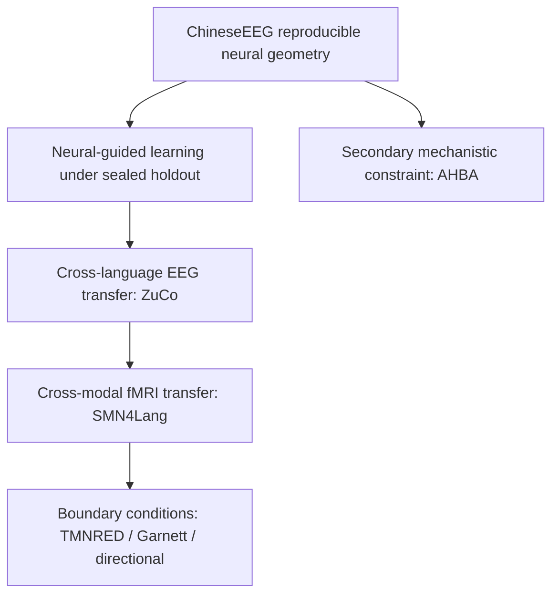

# 5. Current Roadmap

**Last updated:** 2026-08-28

NeuroSem is now in a manuscript-consolidation phase after the successful prospectively frozen SMN4Lang fMRI transfer test.

The immediate goal is not to search for additional positive datasets or larger effects. It is to present the strongest scientific claim with maximal clarity, preserve the null boundary conditions, finalize figures/tables/provenance, and prepare the paper for a high-impact interdisciplinary audience.

## Current scientific position

The project now has five core evidence blocks:

1. **ChineseEEG Little Prince:** reproducible neural relational geometry and neural-guided model learning under held-out evaluation.
2. **ZuCo 2.0 normal reading:** strong independent cross-language EEG replication and positive frozen transfer, 17/17 participants positive.
3. **SMN4Lang fMRI:** strong model-blind language-network reliability followed by positive frozen cross-modal E5 transfer, 12/12 participants positive.
4. **Boundary conditions:** TMNRED null transfer, Garnett Dream null/inconclusive transfer despite reliable neural geometry, and directional-word out-of-task null/negative transfer.
5. **AHBA transcriptomics:** completed primary mechanistic nulls and an exploratory bilateral-processing sensitivity. This is scientifically useful but is no longer the central manuscript axis.

## Central manuscript claim

The strongest current claim is:

> A relational semantic target derived from human neural data can be learned by a language model and can generalize prospectively to independent neural measurements across language, participants, tasks, and measurement modality.

Do not frame the paper as a chronology of datasets or as a claim that brain supervision makes a generally better language model.

## Evidence hierarchy for the paper

This order is conceptual, not chronological.

## SMN4Lang decision

The primary fMRI analysis is complete and positive.

Reliability gate:

- mean residual participant LOO **0.65327**;
- 95% CI **[0.63945, 0.66843]**;
- **12/12** positive;
- exact one-sided sign-flip **p = 0.000244**.

Frozen E5 transfer:

- lambda 0 mean participant RSA **0.12092396**;
- lambda 0.10 mean participant RSA **0.12177646**;
- mean delta **+0.00085250**;
- median delta **+0.00086365**;
- **12/12** positive;
- 95% CI **[+0.00078966,+0.00091398]**;
- exact one-sided sign-flip **p = 0.000244**.

Interpretation: small absolute effect, exceptionally consistent direction, and high scientific value because it is a frozen cross-dataset, cross-participant, cross-task, cross-modal test.

Stop fMRI model searching. Do not reopen lambda, layer, checkpoint, ROI, lag, HRF, semantic-unit, participant, or story selection.

## Main-paper architecture

### Main Result 1: establish the neural target

ChineseEEG reliability-led neural geometry and residual semantic correspondence.

### Main Result 2: establish learnability

Sealed BERT run-07 neural-guided improvement, replicated qualitatively with multilingual E5. Show that generic semantic benchmark performance does not show a stable neural-specific gain.

### Main Result 3: cross-language EEG transfer

ZuCo is the cleanest independent EEG validation. Emphasize new people, laboratory, language, text, and acquisition context.

### Main Result 4: cross-modal fMRI transfer

SMN4Lang is the capstone result. Emphasize:

- naturalistic auditory narratives;
- independent participants;
- independently defined LanA language network;
- model-blind reliability gate before model loading;
- one frozen model contrast;
- 12/12 participant consistency.

### Main Result 5: boundary conditions

TMNRED, Garnett Dream, and directional-word results should be presented together to show that transfer is selective rather than universal.

This strengthens the scientific interpretation and prevents a trivial "the adapter always raises RSA" explanation.

## AHBA placement

The AHBA analysis family remains scientifically complete and locked.

Primary GABAergic/serotonergic/pathway tests are null. Whole-transcriptome PLS and gradient analyses do not survive spatial inference. Published language panels are primary-null. The no-mirror dyslexia-panel result is a post-primary sensitivity driven mainly by right-hemisphere expression-map differences and cannot rescue the primary null.

For the current NeuroSem paper, AHBA should be treated as one of:

- Extended Data / Supplementary mechanistic constraint; or
- a separate future manuscript after independent bilateral transcriptomic validation.

Do not let AHBA become a second conceptual center in the main Nature narrative.

## Figure priorities

1. **Figure 1:** conceptual framework, ChineseEEG neural target, reliability, and sealed neural-guided learning.
2. **Figure 2:** ZuCo cross-language EEG reliability and transfer.
3. **Figure 3:** SMN4Lang model-blind fMRI reliability and prospective cross-modal transfer. This should be the visual centerpiece.
4. **Figure 4:** aligned external-transfer effects and boundary conditions across ZuCo, SMN4Lang, TMNRED, Garnett, and directional-word data; include generic semantic dissociation.

AHBA figures move to Extended Data unless later editorial review indicates otherwise.

## Tables

### Main Table 1: validation design and independence

Columns:

- dataset;
- neural modality;
- task;
- language;
- participant independence;
- text independence;
- neural representation;
- model training on dataset?;
- analysis status;
- role in claim.

### Main Table 2: reliability and frozen transfer

Rows: ChineseEEG, ZuCo, SMN4Lang, TMNRED, Garnett, directional condition.

Columns:

- neural reliability and CI;
- frozen model contrast;
- delta;
- CI;
- fraction participants positive;
- exact inference;
- interpretation.

### Supplementary provenance

Include exact RunRelay job, NeuroSem commit, task, runtime, artifact directory, confirmatory/exploratory classification, and whether any failed predecessor changed only engineering code.

## Optional SMN4Lang MEG arm

MEG is not required to rescue the paper. The fMRI validation already establishes cross-modal generalization.

If MEG is pursued, it must be a separately frozen secondary analysis:

1. model-blind temporal representation freeze;
2. model-blind reliability gate;
3. only if reliable, the same fixed lambda 0.10 versus lambda 0 contrast;
4. no use of the fMRI model result to choose MEG latency, frequency band, sensors, source representation, or semantic unit.

A positive MEG result would create an attractive EEG -> MEG -> fMRI bridge. A null must be retained without rescue search.

## Nature-level editorial test

Nature currently emphasizes technically sound data, strong evidence, novelty, importance to the field, broad scientific interest, and an advance likely to influence thinking. It also emphasizes originality, interdisciplinary interest, accessibility, elegance, and surprising conclusions.

Our strongest route to that standard is not effect-size inflation. It is the combination of:

- an unusual conceptual move from neural geometry to model constraint;
- prospective external tests;
- cross-language EEG convergence;
- cross-modal fMRI convergence;
- matched text-only controls;
- frozen reliability gates;
- explicit null boundary conditions;
- transparent preservation of small effects and negative results.

## Immediate operational order

1. Update authoritative documentation with the completed SMN4Lang fMRI result and final scientific decisions.
2. Rewrite the manuscript outline and figure plan around transferable neural relational constraints.
3. Revise Results/Methods so SMN4Lang is the capstone validation and boundary conditions are grouped together.
4. Build the four main figures and two main tables.
5. Build Extended Data for representation QC, null datasets, full SMN4Lang QC/story heterogeneity, and AHBA.
6. Reconcile final code/provenance from execution branches into a clean canonical analysis state without changing scientific choices.
7. Draft title, abstract, summary paragraph, and editor cover paragraph for a Nature presubmission/editorial read.
8. Decide on the optional MEG arm only after the main manuscript architecture is visible; do not make it a prerequisite for submission.

## Stopping rules

- Do not reopen ZuCo model or representation searches.
- Do not reopen SMN4Lang fMRI model, ROI, lag, HRF, semantic-unit, participant, or story searches.
- Do not reopen Garnett alternatives to rescue its null transfer.
- Do not use TMNRED alternative representations as confirmatory rescue evidence.
- Do not redefine AHBA primary mirrored results after the no-mirror sensitivity.
- Do not screen additional molecular panels until significance appears.
- Preserve all confirmatory nulls in the manuscript record.

## Related documents

- `3_RESULTS_AND_COMPARISONS.md`
- `4_EXPERIMENT_LEDGER.md`
- `8_SMN4LANG_PROSPECTIVE_VALIDATION.md`
- `9_SMN4LANG_FMRI_RELIABILITY_FREEZE.md`
- `10_SMN4LANG_FMRI_E5_TRANSFER_RESULT.md`
- `paper/NATURE_POSITIONING.md`
- `paper/outline.md`
- `paper/FIGURE_TABLE_PLAN.md`
