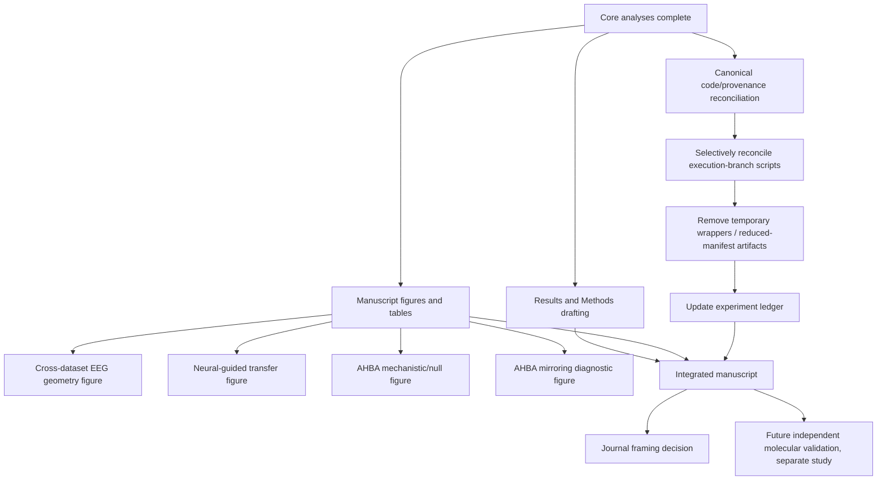

# 5. Current Roadmap

**Last updated:** 2026-08-27

This document states the current NeuroSem plan after completion of the ZuCo external validation, Garnett Dream EEG and model-transfer analyses, the frozen AHBA mechanistic tests, exploratory transcriptomics, published language-panel validation, and the post-hoc AHBA mirroring diagnostic.

The project is now in a **consolidation phase**. The immediate goal is not to search for additional positive results. It is to reconcile final code/provenance, build manuscript-ready figures and tables, and write the paper around the full positive-and-null evidence chain.

## Current position

The project has established six major evidence blocks:

1. **ChineseEEG Little Prince:** discovery of reproducible reading-related EEG geometry and development of neural-guided language-model tuning.
2. **TMNRED:** independent Chinese-reading EEG replication, but null frozen E5 transfer.
3. **ZuCo 2.0 Task 1 Normal Reading:** strong independent English-reading EEG replication and positive frozen ChineseEEG-to-ZuCo E5 transfer.
4. **ChineseEEG Garnett Dream:** positive same-participant/new-text EEG reliability, but null/inconclusive frozen E5 transfer.
5. **Nature directional-word dataset:** out-of-task inner-speech boundary condition with null transfer.
6. **AHBA transcriptomic extension:** completed primary mechanistic nulls, spatially corrected exploratory nulls, independent published language-panel primary nulls, and a strong but exploratory no-mirror hemispheric sensitivity.

## Roadmap overview

## Track 1. Lock the core analysis family

### Garnett Dream

Garnett is complete for the main paper.

Primary EEG reliability:

- mean nuisance-residualized participant LOO reliability **0.01863**;
- 95% CI **[0.01636, 0.02085]**;
- **10/10** participants positive.

Frozen E5 neural-guided lambda .10 minus text-only lambda 0 transfer:

- mean delta **+0.0003266**;
- median **+0.0003319**;
- **6/10** participants positive;
- 95% CI **[-0.0001218, +0.0007560]**;
- one-sided exact sign-flip **p = 0.1016**;
- two-sided exact sign-flip **p = 0.2031**.

Interpretation: same-participant/new-text neural geometry generalizes, but the model-transfer advantage does not generalize convincingly.

Do not search alternative Garnett lambdas, architectures, representations, sensors, layers, or nuisance families to rescue this result.

### AHBA

The AHBA analysis family is also complete for the current paper.

Primary prespecified GABAergic/serotonergic/pathway associations are null.

Exploratory whole-transcriptome PLS1 is spatially nonsignificant despite moderate in-sample alignment (`r = 0.4574`, spatial `p = 0.2745`). No transcriptomic gradient survives FDR.

Independent published language-related panels are also primary-null:

- six-gene connectivity panel: `rho = -0.1515`, spatial `p = 0.4631`;
- fourteen-gene dyslexia panel: `rho = -0.2733`, spatial `p = 0.0516`, spatial BH `q = 0.1032`, co-expression-profile `p = 0.0990`, `q = 0.1980`.

The no-mirror dyslexia-panel sensitivity is strong (`rho = -0.4776`, spatial `p = 0.0032`, co-expression-profile `p = 0.0010`) but remains exploratory. The post-hoc diagnostic shows that this difference is driven primarily by a right-hemisphere expression-map shift rather than parcel missingness.

Do not add unrestricted gene sets, pathway libraries, alternative cortical phenotypes, or post-hoc subsets based on these outcomes.

## Track 2. Reconcile final code and provenance

Several AHBA jobs ran on narrow execution branches with reduced manifests, compatibility launchers, or temporary technical fixes. These branches should **not** be merged wholesale into canonical `main`.

Instead:

1. Identify the final scientific scripts for each completed analysis.
2. Selectively port only the scientifically relevant code into canonical `main`.
3. Remove temporary compatibility files, placeholder files, and execution-only notes where they are no longer needed.
4. Preserve exact commit/job provenance in `4_EXPERIMENT_LEDGER.md`.
5. Ensure `.runrelay/project.yaml` on `main` contains only intentional canonical tasks.
6. Verify documentation points to the final script/task names rather than failed intermediate variants.

This code-reconciliation work is a documentation/reproducibility task, not a new scientific analysis.

## Track 3. Manuscript figures and tables

### Figure family A: reproducible neural geometry

Show the hierarchy of EEG-only evidence:

- ChineseEEG Little Prince development geometry;
- TMNRED independent Chinese-reading reliability;
- ZuCo independent English-reading reliability;
- Garnett same-participant/new-text reliability.

The figure should make clear that the same simple temporal-mean representation was prospectively carried across datasets.

### Figure family B: model transfer

Show the frozen neural-guided-minus-text-only contrasts:

- TMNRED: null;
- ZuCo: positive and highly consistent;
- Garnett: null/inconclusive;
- Nature: out-of-task null.

The message is **task-matched transfer can occur but is not universal**.

### Figure family C: AHBA mechanistic extension

Recommended panels:

1. AHBA-to-EEG spatial mapping schematic.
2. Prespecified GABA/serotonin/pathway null results.
3. Exploratory PLS1 versus spatial-null distribution.
4. Published connectivity/dyslexia panel primary results.
5. Mirrored versus no-mirror dyslexia-panel hemisphere decomposition.

Captions must explicitly label confirmatory, exploratory, and post-hoc diagnostic components.

### Core tables

Prepare manuscript-ready tables for:

- dataset/task roles and independence;
- EEG reliability across datasets;
- frozen model-transfer contrasts;
- AHBA primary/exploratory/published-panel results;
- exact RunRelay job/commit provenance for reproducibility supplements.

## Track 4. Results and Methods drafting

Draft Results in evidence order rather than chronological debugging order:

1. ChineseEEG discovery geometry.
2. BERT/E5 neural-guided within-development alignment.
3. Independent reading EEG replication.
4. Cross-dataset model transfer, including both positive and null results.
5. Garnett same-participant/new-text boundary.
6. Nature out-of-task boundary.
7. AHBA mechanistic extension and null framework.
8. AHBA mirroring sensitivity as a separate methodological observation.

Draft Methods directly from frozen protocols and final committed scripts. Failed jobs belong mainly in provenance/supplementary audit material unless they explain an important methodological choice.

## Track 5. Journal framing

Do not choose the journal by adding analyses to fit a narrative.

Current evidence supports a paper centered on:

- reproducible semantic neural geometry across reading datasets/languages;
- a neural-guided modeling effect that transfers strongly to ZuCo but not universally;
- a disciplined mechanistic AHBA extension whose main result is null and whose most interesting finding is a hemispheric preprocessing sensitivity.

Possible framing:

- **Nature Machine Intelligence** if the neural-guided representation-learning contribution remains central after manuscript assembly.
- **Nature Neuroscience** if the stronger story is reproducible neural geometry, cross-language validation, and the methodological/biological implications of the transcriptomic extension.

The final target should follow the integrated manuscript.

## Track 6. Future molecular validation, separate from current paper

If the AHBA no-mirror dyslexia-panel signal is pursued further, the next step should be **independent validation**, not more AHBA subset search.

Preferred future directions:

- a transcriptomic resource with stronger bilateral cortical sampling;
- prospectively frozen left/right language-network analyses;
- cortical layer-resolved spatial transcriptomics;
- an independent imaging-transcriptomic dataset using the same frozen 14-gene panel and hemispheric hypothesis.

A future study should preregister the hemisphere hypothesis and the exact published gene panel before inspecting the new outcome.

## Stopping rules

- Do not reopen ZuCo lambda, representation, sensor, layer, pooling, or window searches.
- Do not reopen Garnett lambda, architecture, representation, or nuisance searches.
- Do not redefine the AHBA primary mirrored result after observing the no-mirror sensitivity.
- Do not screen additional gene subsets/pathway libraries until significance appears.
- Do not promote individual dyslexia-panel genes as discoveries from the post-hoc decomposition.
- Do not interpret AHBA as participant-specific molecular measurement or causal receptor evidence.
- Preserve null findings in the main manuscript.

## Immediate operational order

1. Update authoritative docs and experiment ledger with final Garnett and AHBA outcomes.
2. Selectively reconcile final analysis code from execution branches into canonical `main`.
3. Build the manuscript figure/table set.
4. Draft Results and Methods from the frozen evidence chain.
5. Prepare supplementary provenance tables with exact jobs/commits and analysis classifications.
6. Review the complete manuscript narrative before deciding whether any genuinely necessary analysis is still missing.
7. Treat any future bilateral transcriptomic test as a separate, prospectively frozen validation study.

## Related documents

- `1_PROJECT_OVERVIEW.md`
- `3_RESULTS_AND_COMPARISONS.md`
- `4_EXPERIMENT_LEDGER.md`
- `6_AHBA_CURRENT_STATUS_AND_NEXT_STEPS.md`
- `abbas_ahba_transcriptomic_extension.md`
