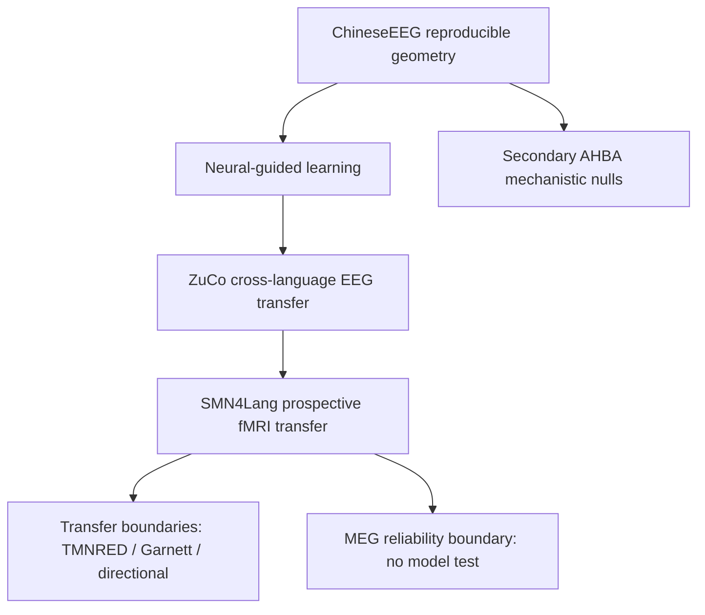

# 5. Current Roadmap

**Last updated:** 2026-08-28

NeuroSem is now in an **evidence-locked manuscript-consolidation phase**. The primary scientific analyses for the current paper are complete. The immediate goal is not to search for additional positive datasets or larger effects; it is to finish the submission package, complete the remaining composite figures, preserve provenance, and keep the repository internally consistent.

## Final scientific position for the present paper

The project has six core evidence blocks:

1. **ChineseEEG Little Prince:** reproducible neural relational geometry and neural-guided model learning under held-out evaluation.
2. **ZuCo 2.0 normal reading:** independent cross-language EEG reliability and positive frozen transfer, **17/17** participants positive.
3. **SMN4Lang fMRI:** model-blind language-network reliability followed by positive frozen cross-modal E5 transfer, **12/12** participants positive. This is the prospective capstone.
4. **Transfer boundaries:** TMNRED null transfer, Garnett Dream null/inconclusive transfer despite reliable neural geometry, and directional inner-speech out-of-task null/negative transfer.
5. **SMN4Lang MEG reliability boundary:** the prospectively frozen 32-bin sensor-level target failed its model-blind reliability gate; a separately frozen 4/8/16-bin family also failed. No model evaluation was performed. The MEG branch is closed for this paper.
6. **AHBA transcriptomics:** completed primary mechanistic nulls and an exploratory bilateral-processing sensitivity. This remains secondary/Extended Data material.

## Central manuscript claim

> Human neural geometry can provide a transferable relational constraint on language representations, with effects that generalize across independent brains, languages and measurement modalities, but not universally across neural contexts.

Do not frame the work as showing a generally better language model, a universal semantic geometry, a negative MEG transfer effect, or a specific transcriptomic mechanism.

## Evidence hierarchy

## SMN4Lang final decisions

### fMRI

The fMRI analysis is complete and positive:

- reliability mean residual LOO **0.65327**, 95% CI **[0.63945,0.66843]**, **12/12** positive, exact one-sided **p = 0.000244**;
- frozen E5 transfer mean delta **+0.00085250**, 95% CI **[+0.00078966,+0.00091398]**, **12/12** positive, exact one-sided **p = 0.000244**.

No fMRI model/representation search should be reopened.

### MEG

The MEG branch is also complete:

- prospective 32-bin sensor-level RMS mean LOO reliability **0.007713**;
- 95% CI **[-0.007627,+0.021655]**;
- exact one-sided **p = 0.16870**;
- gate failed; no E5 evaluation.

The bounded post-confirmatory 4/8/16-bin family produced no familywise-reliable target. This demonstrates that the failed 32-bin target was not simply rescued by straightforward temporal coarsening within the same representation family. It does **not** establish that MEG generally lacks transferable language-related structure.

No further MEG alternatives should be run for the present manuscript.

## Main-paper architecture

### Figure 1
Conceptual framework, ChineseEEG reliability-led target, residual model correspondence, sealed BERT neural-guided learning, and E5/generic-semantic dissociation.

### Figure 2
ZuCo cross-language EEG reliability and paired frozen E5 transfer.

### Figure 3
SMN4Lang prospective fMRI reliability gate, frozen causal semantic-to-fMRI mapping, and paired participant transfer. This is the visual centerpiece.

### Figure 4
Generalization/boundary map: harmonized external outcomes, SMN4Lang MEG reliability boundary, independence/design matrix, and generic semantic benchmark/conceptual conclusion. Raw EEG/fMRI/MEG RSA values must not be presented as a common effect-size scale.

AHBA remains Extended Data / Supplementary unless requested editorially.

## Manuscript state

Authoritative submission-facing files:

- `paper/NATURE_SUBMISSION_PACKAGE.md`
- `paper/NATURE_MANUSCRIPT_DRAFT_V2.md`
- `paper/REFERENCE_SOURCE_AUDIT.md`

`NATURE_MANUSCRIPT_DRAFT_V1.md`, `outline.md`, `results.md`, and `methods.md` are retained as development history/scaffolds and should not override v2.

The current Word submission working copy was produced from v2 with Zotero-compatible fields outside the repository build flow; the repository source of truth remains the Markdown manuscript plus verified reference audit until a binary manuscript packaging policy is deliberately adopted.

## Immediate operational order

1. Keep canonical documentation synchronized with the final fMRI and MEG decisions.
2. Complete the missing composite artwork for Figures 1, 3 and Figure 4a/c/d strictly from locked outputs.
3. Replace placeholders in the submission working copy and run a final figure/legend consistency audit.
4. Keep the reference/source audit synchronized with any citation edits.
5. Recheck exact job/commit/artifact provenance for every main-text numerical result and figure source.
6. Perform final repository hygiene and submission-readiness checks; do not generate new outcome-bearing analyses.

## Stopping rules

- No new dataset search for positive transfer.
- No reopening of ZuCo or SMN4Lang fMRI model/representation choices.
- No rescue search for TMNRED or Garnett.
- No E5 evaluation on failed MEG targets.
- No further MEG bands, sensors, sources, latencies or temporal alternatives.
- No additional AHBA significance search or molecular-panel screening.
- Preserve all confirmatory nulls and reliability failures.

## Related documents

- `1_PROJECT_OVERVIEW.md`
- `3_RESULTS_AND_COMPARISONS.md`
- `4_EXPERIMENT_LEDGER.md`
- `8_SMN4LANG_PROSPECTIVE_VALIDATION.md`
- `9_SMN4LANG_FMRI_RELIABILITY_FREEZE.md`
- `10_SMN4LANG_FMRI_E5_TRANSFER_RESULT.md`
- `12_SMN4LANG_MEG_MODEL_BLIND_PROBE_PROTOCOL.md`
- `13_SMN4LANG_MEG_REPRESENTATION_FREEZE.md`
- `14_SMN4LANG_MEG_EXPLORATORY_GRANULARITY_FREEZE.md`
- `paper/NATURE_SUBMISSION_PACKAGE.md`
- `paper/NATURE_MANUSCRIPT_DRAFT_V2.md`
- `paper/REFERENCE_SOURCE_AUDIT.md`
