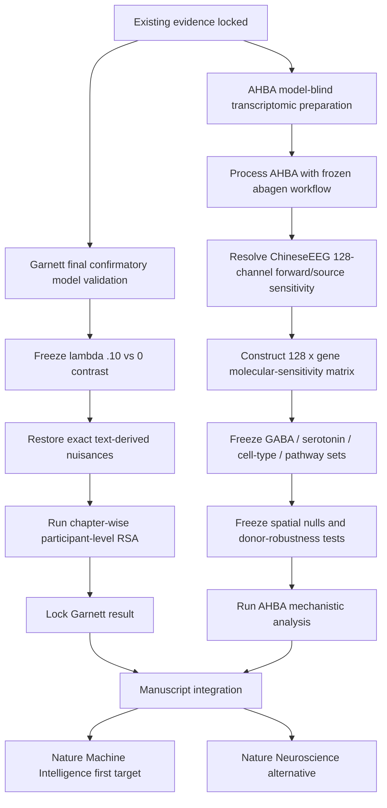

# 5. Current Roadmap

**Last updated:** 2026-08-26

This document states the current NeuroSem plan after completion of the ZuCo external validation, Garnett Dream EEG reliability, and Garnett Dream exact row-text mapping. It is the operational roadmap for the next manuscript-level analyses.

## Current position

The project has now established four distinct forms of evidence:

1. **ChineseEEG Little Prince:** discovery of reproducible reading-related EEG geometry and development of neural-guided language-model tuning.
2. **TMNRED:** independent Chinese-reading EEG replication, but null frozen E5 transfer.
3. **ZuCo 2.0 Task 1 Normal Reading:** strong independent English-reading EEG replication and positive frozen ChineseEEG-to-ZuCo E5 transfer.
4. **ChineseEEG Garnett Dream:** same-participant/new-text EEG reliability has passed, and the exact presentation-row to segmented-text mapping is now frozen. The model-transfer result has not yet been run.

The Nature directional-word dataset remains an out-of-task boundary condition rather than a task-matched reading replication.

The project also has a separately planned mechanistic extension proposed by Abbas: transcriptomic modulation of the 128-channel ChineseEEG geometry using the Allen Human Brain Atlas (AHBA).

## Roadmap overview

## Track 1. Finish Garnett Dream confirmatory validation

### What is already frozen

Garnett Dream is a **same-participant / new-text validation**, not an independent cohort replication.

Completed steps:

- model-blind structural audit;
- frozen `ROWS -> ROWE` presentation-row unit;
- frozen filtered BrainVision source family;
- materialization of the structurally valid Garnett input set;
- EEG-only primary reliability analysis;
- exact non-display segmented-XLSX row-text mapping.

### Garnett EEG reliability already passed

Primary `row_mean_all` result:

- mean nuisance-residualized participant LOO reliability: **0.01863**;
- median: **0.01895**;
- **10/10 participants positive**;
- participant-bootstrap 95% CI: **[0.01636, 0.02085]**;
- exact one-sided sign-flip p: **0.0009766**;
- mean raw LOO reliability: **0.03545**.

Predeclared sensitivity representations were also positive:

- `row_std_all`: residual mean about **0.04443**, 10/10 participants positive;
- `relative_8bin_all`: residual mean about **0.00407**, 9/10 participants positive.

These sensitivity results do not replace the prospectively designated `row_mean_all` primary representation.

### Exact text mapping is now frozen

The segmented-XLSX mapping probe established a unique header-aware mapping for all 18 Garnett chapters/runs.

Frozen rule:

`CHxx_ROWyyyy -> physical XLSX row yyyy + 1`

where physical row 1 is the validated `Chinese_text` schema header in the unique non-display segmented workbook for that chapter/run.

Across the 18 chapters, the frozen presentation set contains **9,047** linguistic items. The mapping was resolved model-blind, before any Garnett model-transfer outcome.

### Next Garnett analysis

Run exactly one confirmatory model validation using the already-trained ChineseEEG multilingual-E5 adapters:

- EEG target: frozen `row_mean_all` only;
- primary model contrast: **lambda 0.10 neural-guided minus lambda 0 text-only**;
- no Garnett training or tuning;
- no lambda sweep;
- no sensor, time-window, layer, architecture, pooling, item, or participant search based on Garnett outcomes;
- analyze chapters separately;
- use participant as the inferential unit;
- Fisher-z aggregate chapter-level RSA values within participant.

Now that exact text is available, restore the full applicable nuisance family prospectively:

1. within-chapter row/order difference;
2. presentation-duration difference;
3. character-count difference;
4. punctuation-count difference;
5. character-set Jaccard distance.

Primary endpoint:

`Delta RSA = residual RSA(lambda=.10) - residual RSA(lambda=0)`

Report mean and median participant delta, fraction positive, participant-bootstrap 95% CI, and exact sign-flip inference.

After this result is produced, lock it before running any post-confirmatory sensitivity analysis.

## Track 2. Abbas AHBA transcriptomic extension

Abbas proposed adding an Allen Human Brain Atlas molecular layer to the ChineseEEG 128-channel spatial geometry. This is a central planned mechanistic extension, not an optional note.

### Scientific question

> Are cortical locations that contribute more strongly to the established semantic neural geometry preferentially associated with specific molecular systems?

A secondary operational question is whether prespecified molecular spatial weightings systematically change the frozen EEG-model RSA.

### Required mapping

Do **not** treat scalp electrodes as literal cortical parcels.

Use:

`AHBA cortical transcriptomics -> cortical spatial map -> EEG forward/source-sensitivity projection -> 128-channel molecular weighting -> frozen NeuroSem analysis`

For cortical gene or gene-set map `X(v)` and electrode/source sensitivity `L(e,v)`:

`w_e = sum_v L(e,v) X(v)`

The target preparation output is a reproducible **128 x G** molecular-sensitivity matrix, where `G` is the retained gene set after frozen AHBA preprocessing.

### AHBA Stage A. Model-blind preprocessing

Before touching NeuroSem molecular outcomes:

- process AHBA using a reproducible `abagen` workflow;
- freeze default-like intensity filtering with `ibf_threshold=0.5`;
- freeze probe selection/gene aggregation;
- freeze normalization;
- freeze donor handling;
- freeze the bilateral/hemisphere strategy;
- record the retained gene count rather than forcing a target count;
- resolve and freeze the exact ChineseEEG 128-channel montage, reference, head model, cortical source space, and sensitivity convention.

### AHBA Stage B. Freeze biological families

Prespecify the molecular families before outcome analysis.

Core groups:

- **GABA-A receptor subunits**;
- broader **GABAergic machinery**, including synthesis/transport/vesicular genes such as `GAD1`, `GAD2`, `SLC6A1`, `SLC32A1` subject to final annotation review;
- **serotonin receptors**;
- broader **serotonergic machinery**;
- human cell-type marker sets for excitatory neurons, inhibitory neurons, astrocytes, oligodendrocytes, OPCs, microglia, endothelial/vascular cells, and only other prespecified justified classes;
- a **small curated pathway panel**, not an unrestricted screen of thousands of pathways.

For multi-gene sets, standardize each gene spatially before averaging. Do not sum raw expression values with incomparable dynamic ranges.

### AHBA Stage C. Frozen mechanistic tests

Two complementary analyses may be run if both are frozen before outcome access:

1. **Molecular weighting analysis:** multiply the frozen EEG channel representation by each prespecified 128-element molecular map and test the change in the existing neural-model geometry.
2. **Spatial contribution analysis:** estimate a stable channel/source contribution map for the established semantic effect, then test association with the prespecified molecular maps.

The second analysis is expected to provide the cleaner biological interpretation.

### Required AHBA controls

- leave-one-donor-out robustness;
- spatial-autocorrelation-preserving null maps;
- gene-set-size-matched random gene sets;
- multiplicity correction across the prespecified molecular families;
- robustness to the frozen bilateral handling strategy;
- broad cortical-gradient/nonspecific spatial controls where feasible.

Interpret AHBA as a population-level spatial prior from six postmortem donors, not as molecular measurements of the ChineseEEG participants.

## Track 3. Manuscript consolidation

Manuscript work should proceed while Garnett and AHBA are being completed. Do not wait until every analysis is done to structure the paper.

Proposed evidence architecture:

1. **ChineseEEG Little Prince:** discovery and development neural geometry.
2. **Neural-guided BERT/E5:** within-development neural alignment improvement.
3. **TMNRED:** independent Chinese-reading geometry replication and null model-transfer boundary.
4. **ZuCo:** independent English-reading/cross-language geometry replication and positive frozen E5 transfer.
5. **Garnett Dream:** same-participant/new-narrative generalization.
6. **Nature directional:** out-of-task boundary condition.
7. **AHBA transcriptomics:** separately frozen molecular-mechanistic extension.

The manuscript must preserve the null findings rather than present only the positive ZuCo result.

## Stopping rules

- Do not reopen ZuCo lambda, representation, sensor, layer, pooling, or window searches.
- Do not change the Garnett primary representation based on Garnett sensitivity results.
- Do not search alternative Garnett lambdas or model architectures if the confirmatory transfer is null.
- Do not use AHBA outcomes to redefine the primary EEG representation or the existing external validation analyses.
- Do not screen unrestricted pathway libraries after inspecting molecular results.
- A null Garnett result narrows narrative/model-transfer generalization.
- A null AHBA result narrows molecular interpretation and leaves the primary cross-dataset evidence unchanged.

## Immediate operational order

1. Implement and run the frozen Garnett E5 lambda .10 vs 0 model-transfer analysis.
2. In parallel, begin AHBA model-blind preprocessing and 128-channel source-sensitivity preparation.
3. Freeze AHBA biological families, cell-type marker references, bilateral strategy, and spatial-null framework.
4. Run the frozen AHBA mechanistic analyses.
5. Lock manuscript figures/tables and finalize the submission narrative.

## Publication target

Current aspirational order:

1. **Nature Machine Intelligence** if the full evidence supports a machine-learning contribution centered on transferable neural alignment and mechanistic interpretation.
2. **Nature Neuroscience** if the final strength lies more in reproducible neural geometry and biological mechanism than in transferable representation learning.

The target should follow the final evidence, not drive post-hoc analysis choices.
